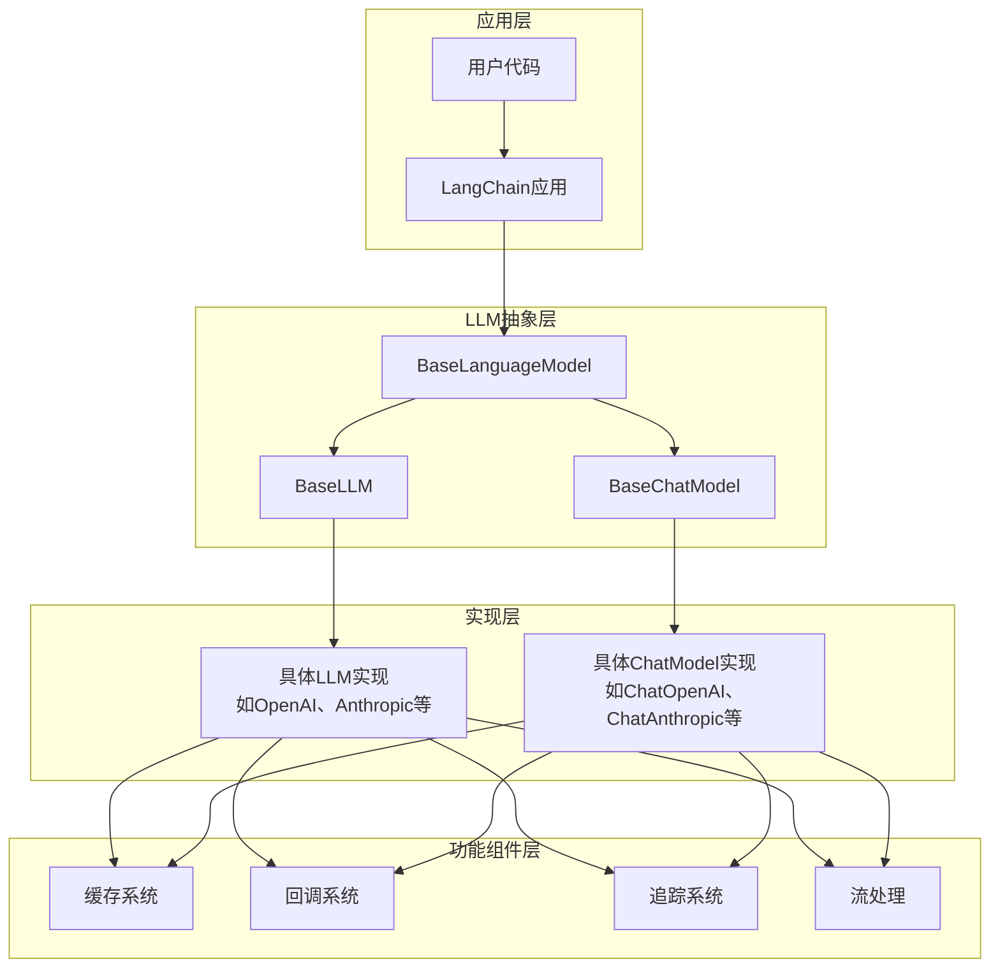
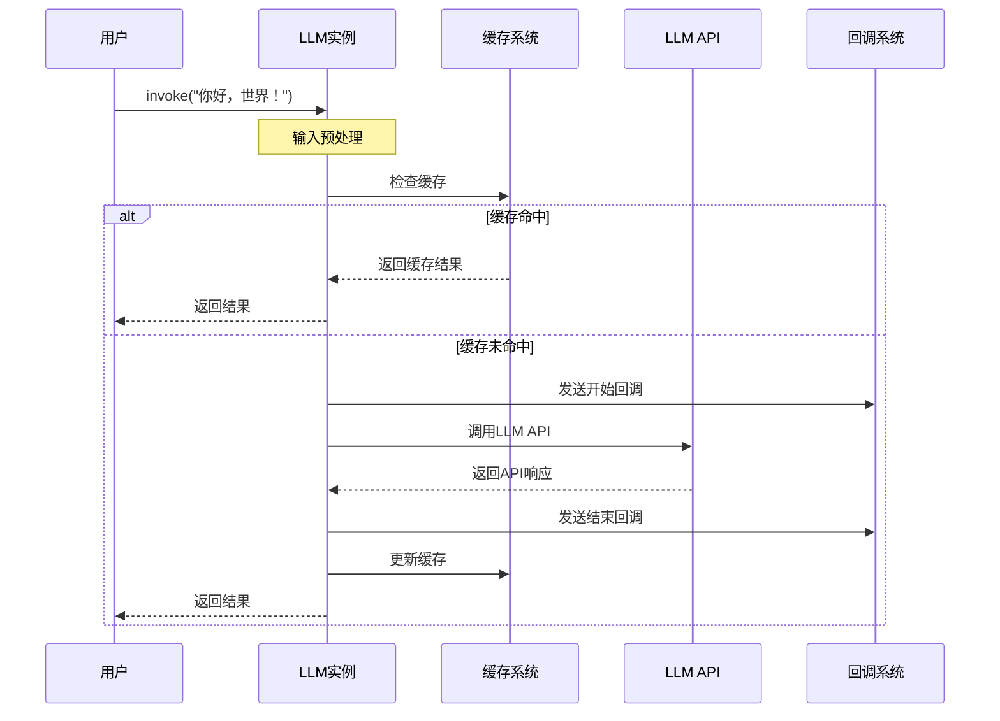
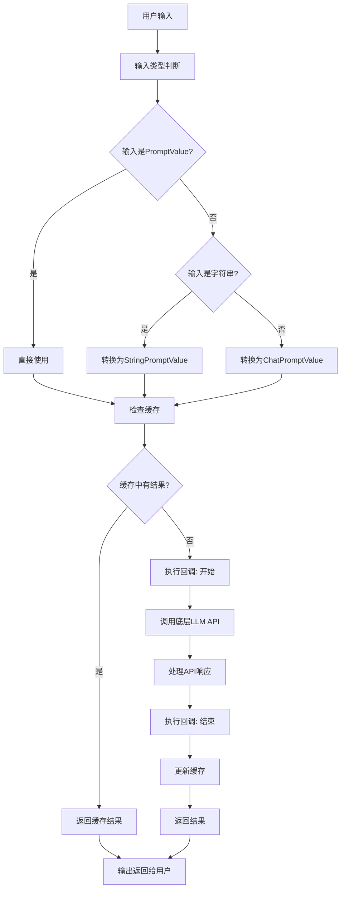

# LangChain LLM完全指南：从零开始理解大语言模型交互原理

## 什么是大语言模型（LLM）？一个生动的比喻

想象一下，大语言模型就像是一个超级博学的图书管理员，他读遍了世界上所有的书籍、文章、网页，拥有海量的知识。当你向他提问时，他能根据自己的知识储备给你一个详细的回答。

在计算机世界里，LLM（Large Language Model，大语言模型）就是这样一个"智能助手"。它通过深度学习技术，学会了理解和生成人类语言，可以回答问题、创作文章、写代码、进行逻辑推理等。

## 为什么需要LangChain来管理LLM？

直接使用LLM就像直接和一个没有界面的超级大脑对话，虽然它很聪明，但交流起来并不方便。LangChain就像一个智能翻译官和管理器，它：

1. **简化交互**：提供统一的接口，让不同厂商的LLM使用方式保持一致
2. **提升性能**：通过缓存避免重复请求，节省时间和费用
3. **增强功能**：提供回调、追踪、流式输出等高级功能
4. **错误处理**：自动重试、异常处理等

## LangChain LLM工作原理解析

### 1. 抽象基类：统一的接口标准

```python
# 想象LangChain为所有LLM定义了一个"标准操作流程"
class BaseLanguageModel:
    def invoke(self, input):
        """标准调用方法，所有LLM都遵循这个流程"""
        # 1. 输入预处理
        # 2. 检查缓存
        # 3. 调用模型API
        # 4. 处理输出
        # 5. 更新缓存
        pass
```

就像所有汽车都必须有方向盘、油门和刹车一样，所有LLM都必须实现这些标准方法。

### 2. 缓存机制：聪明的记忆系统

想象一下，如果有人问你"1+1等于几？"，你第一次回答后，会把答案记在心里。下次再有人问同样问题，你就不需要重新计算，直接给出答案。

```python
# LangChain的缓存就是这样工作的
def check_cache(prompt, llm_params):
    cache_key = generate_cache_key(prompt, llm_params)
    cached_result = cache.get(cache_key)
    if cached_result:
        return cached_result # 直接返回缓存结果
    else:
        result = call_llm_api(prompt)  # 调用API
        cache.set(cache_key, result)   # 存入缓存
        return result
```

### 3. 回调系统：全程监控助手

就像一个贴心的助手，会在每个关键步骤告诉你进度："正在连接模型...开始生成...生成完成"。

```python
# 回调系统在LLM执行过程中的关键节点触发
class CallbackManager:
    def on_llm_start(self, serialized, prompts, **kwargs):
        """LLM开始执行时调用"""
        print("LLM开始处理请求...")
    
    def on_llm_new_token(self, token, **kwargs):
        """生成新token时调用"""
        print(f"生成新内容: {token}")
    
    def on_llm_end(self, response, **kwargs):
        """LLM执行结束时调用"""
        print("LLM处理完成")
```

### 4. 流式处理：实时响应体验

传统方式是等LLM把话说完再给你，流式处理则是边说边给，就像实时聊天一样。

```python
# 流式处理让用户体验更流畅
def stream_response(prompt):
    for chunk in llm._stream(prompt):
        yield chunk.text  # 每生成一部分就立即返回
```

## 实际应用示例

### 基础使用

```python
from langchain_openai import ChatOpenAI

# 创建LLM实例
llm = ChatOpenAI(model="gpt-3.5-turbo", temperature=0.7)

# 简单调用
response = llm.invoke("介绍一下人工智能")
print(response.content)
```

### 批量处理

```python
# 批量处理多个请求，提高效率
prompts = ["问题1", "问题2", "问题3"]
responses = llm.batch(prompts)
for response in responses:
    print(response.content)
```

### 流式输出

```python
# 流式输出，实时显示生成过程
for chunk in llm.stream("写一个关于机器人的故事"):
    print(chunk.content, end="", flush=True)
```

### 使用缓存

```python
from langchain_core.caches import InMemoryCache
from langchain_core.globals import set_llm_cache

# 设置缓存
set_llm_cache(InMemoryCache(maxsize=1000))

# 重复请求时会直接从缓存返回
response1 = llm.invoke("什么是AI?")
response2 = llm.invoke("什么是AI?")  # 这次会从缓存获取
```

## 核心优势总结

1. **统一接口**：无论使用OpenAI、Anthropic还是其他厂商的模型，接口都一样
2. **性能优化**：缓存机制避免重复计算，批量处理提高吞吐量
3. **可观测性**：回调和追踪系统让整个过程透明可控
4. **容错能力**：内置重试机制和错误处理
5. **扩展性**：支持流式输出、结构化输出等高级功能

## 学习建议

1. **从基础开始**：先理解`BaseLanguageModel`的基本概念和方法
2. **实践操作**：尝试使用不同类型的LLM，观察它们的共同点
3. **深入了解**：研究缓存、回调、流式处理等高级功能的实现
4. **自定义实现**：尝试创建自己的LLM包装器，加深理解

LangChain的LLM模块就像一座桥梁，连接了开发者和强大的AI模型，让复杂的技术变得简单易用。掌握这些原理，你就能更好地利用大语言模型的强大能力构建各种AI应用。

# LangChain LLM技术架构图、时序图和流程图

## 1. 技术架构图



## 2. 调用时序图



## 3. 流程图



## 4. 示例代码

```python
# 基本LLM使用示例
from langchain_core.language_models.llms import LLM
from langchain_core.callbacks import CallbackManager
from langchain_core.outputs import Generation, LLMResult

# 自定义LLM实现
class CustomLLM(LLM):
    n: int = None  # 自定义参数
    
    @property
    def _llm_type(self) -> str:
        return "custom"
    
    def _call(
        self,
        prompt: str,
        stop: Optional[list[str]] = None,
        run_manager: Optional[CallbackManagerForLLMRun] = None,
        **kwargs: Any,
    ) -> str:
        # 实现具体的LLM调用逻辑
        # 这里只是示例，实际会调用具体的模型API
        return f"模型响应: {prompt}"
    
    @property
    def _identifying_params(self) -> dict[str, Any]:
        return {"n": self.n}

# 使用示例
llm = CustomLLM(n=10)
result = llm.invoke("你好，世界！")
print(result)  # 输出: 模型响应: 你好，世界！

# 批量处理示例
results = llm.batch(["你好", "世界", "！"])
print(results)  # 输出: ['模型响应: 你好', '模型响应: 世界', '模型响应: ！']

# 流式处理示例
for chunk in llm.stream("生成长文本"):
    print(chunk, end="")  # 逐块输出结果
```

# LangChain LLM关键技术原理

## 1. 抽象基类设计模式

LangChain LLM采用了抽象基类设计模式，通过`BaseLanguageModel`、`BaseLLM`和`BaseChatModel`定义了统一的接口。

**核心原理：**
- `BaseLanguageModel`是所有语言模型的根抽象类，定义了通用接口
- `BaseLLM`专门处理字符串输入输出场景
- `BaseChatModel`专门处理对话消息场景

## 2. 缓存机制

缓存是提高LLM应用性能的关键技术，LangChain提供了灵活的缓存策略。

**核心原理：**
- 在调用LLM前先检查缓存
- 使用LLM参数和输入作为缓存键
- 支持同步和异步缓存操作
- 缓存命中时跳过API调用，直接返回结果

## 3. 回调系统

回调系统允许在LLM执行过程中插入自定义逻辑，如日志记录、进度追踪等。

**核心原理：**
- 在LLM执行的关键节点触发回调
- 支持开始、结束、错误、token生成等回调事件
- 提供同步和异步回调管理器

## 4. 流式处理

流式处理允许逐步接收LLM输出，提供更好的用户体验。

**核心原理：**
- 通过`_stream`和`_astream`方法实现
- 支持实时token输出
- 兼容非流式模型的回退机制

## 5. 输入输出标准化

LangChain将各种输入格式统一转换为标准格式进行处理。

**核心原理：**
- 将字符串、消息列表、PromptValue等转换为统一格式
- 提供输入验证和类型转换
- 支持多种输出格式

## 6. 并发处理

通过批量处理和异步调用提高吞吐量。

**核心原理：**
- `batch`方法并行处理多个请求
- `abatch`方法异步并行处理
- 支持最大并发数限制