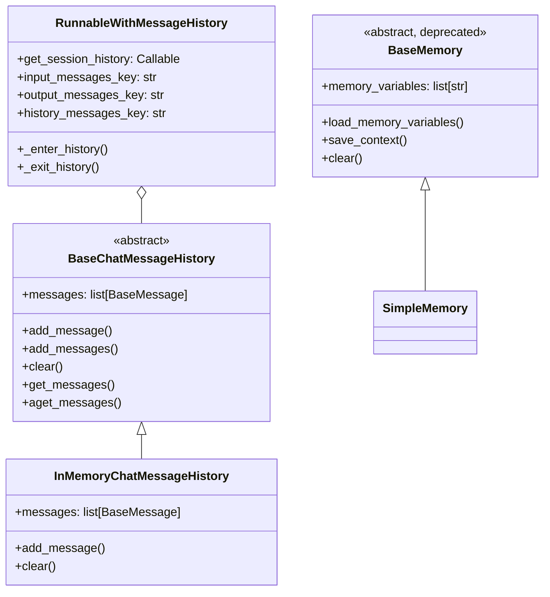
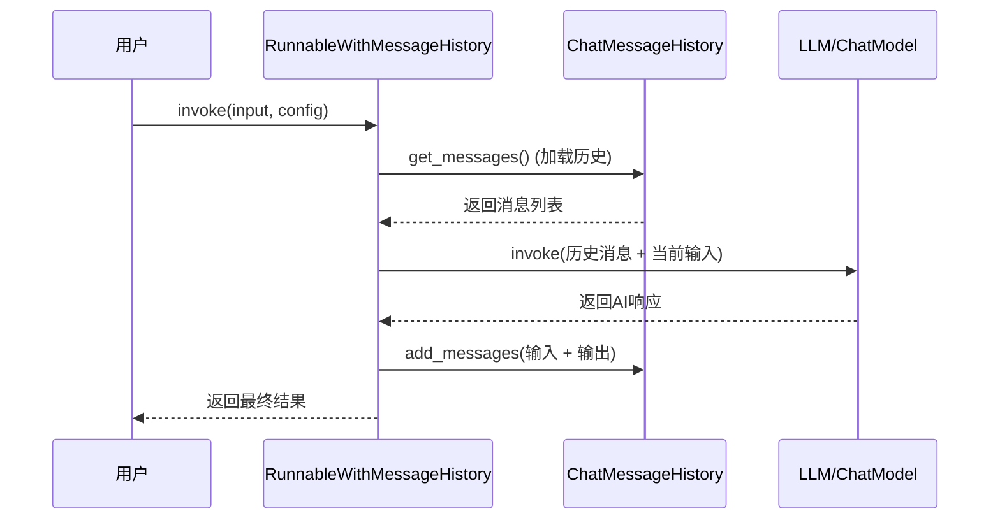
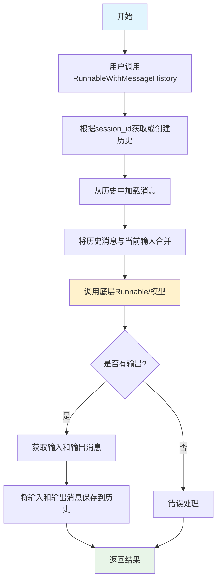

# LangChain记忆模块：深入理解对话记忆与上下文管理

## What - 什么是LangChain记忆模块？

LangChain记忆模块是LangChain框架中用于管理对话历史和上下文信息的核心组件。它提供了一套标准化的机制来存储、检索和管理AI模型在对话过程中需要的上下文信息。

### 核心概念
- **BaseMemory**: 所有记忆实现的基类（现已弃用）
- **BaseChatMessageHistory**: 聊天消息历史的基类，用于存储对话消息
- **RunnableWithMessageHistory**: 包装器类，自动管理聊天历史
- **InMemoryChatMessageHistory**: 内存中的聊天历史实现

## Why - 为什么需要记忆模块？

### 1. 上下文连续性
AI对话通常需要上下文。没有记忆机制，AI每次回应都是独立的，无法理解之前的对话内容。

**比喻理解**：就像两个人聊天，如果每句话都是独立的，不记得之前的对话，就无法进行有意义的交流。

### 2. 对话历史管理
记忆模块提供了统一的方式来管理对话历史，包括：
- 存储用户和AI的交互记录
- 管理多轮对话的上下文
- 支持工具调用后的结果整合

### 3. 会话隔离
不同用户的对话需要隔离，记忆模块通过session_id等机制实现会话管理。

### 4. 状态持久化
记忆模块支持将对话历史持久化到不同存储后端，如内存、数据库、Redis等。

## How - 记忆模块是如何工作的？

### 1. 基本架构



### 2. 消息流转时序图



### 3. 核心工作流程



### 4. 实现代码示例

```python
from langchain_core.chat_history import BaseChatMessageHistory
from langchain_core.messages import HumanMessage, AIMessage
from langchain_core.runnables.history import RunnableWithMessageHistory
from langchain_core.prompts import ChatPromptTemplate, MessagesPlaceholder

# 1. 创建自定义聊天历史实现
class InMemoryHistory(BaseChatMessageHistory):
    """内存聊天历史实现"""
    def __init__(self):
        self.messages = []
    
    def add_message(self, message):
        """添加消息到历史"""
        self.messages.append(message)
    
    def clear(self):
        """清空历史"""
        self.messages = []

# 2. 创建会话历史工厂函数
store = {}
def get_by_session_id(session_id: str) -> BaseChatMessageHistory:
    if session_id not in store:
        store[session_id] = InMemoryHistory()
    return store[session_id]

# 3. 创建带历史的可运行对象
prompt = ChatPromptTemplate.from_messages([
    ("system", "你是一个有用的助手"),
    MessagesPlaceholder(variable_name="history"),  # 历史占位符
    ("human", "{input}")
])

# 4. 包装成带历史的Runnable
chain_with_history = RunnableWithMessageHistory(
    prompt | chat_model,  # 底层链
    get_by_session_id,    # 会话历史工厂
    input_messages_key="input",      # 输入键
    history_messages_key="history"   # 历史键
)

# 5. 使用示例
response = chain_with_history.invoke(
    {"input": "你好"},
    config={"configurable": {"session_id": "abc123"}}
)
```

## 记忆模块的核心特性

### 1. 会话管理
- 每个会话都有独立的历史记录
- 通过session_id进行会话隔离
- 支持多用户并发访问

### 2. 异步支持
- 提供异步版本的方法（aadd_messages, aget_messages等）
- 支持异步调用链

### 3. 灵活的存储后端
- 内存存储（开发测试用）
- 数据库存储（生产环境）
- Redis存储（分布式环境）

### 4. 自动历史管理
- 自动加载历史消息
- 自动保存新的对话
- 智能处理消息去重

## 实际应用场景

### 1. 简单对话助手
```python
# 基础聊天机器人，保持对话上下文
messages = [
    SystemMessage(content="你是一个友好的助手"),
    HumanMessage(content="你好"),
    AIMessage(content="你好！有什么可以帮助你的吗？"),
    HumanMessage(content="我叫张三")  # AI会记住用户的名字
]
```

### 2. 多轮对话系统
```python
# 复杂的多轮对话，AI需要记住之前的上下文
# 用户: "我想要一个推荐的餐厅"
# AI: "您想要什么类型的餐厅？"
# 用户: "中餐"
# AI: "您在哪个城市？"  # 需要记住之前提到的餐厅类型
# 用户: "北京"
# AI: "推荐您北京的中餐厅..."  # 需要记住餐厅类型和城市
```

### 3. 工具增强对话
```python
# AI调用工具后，需要将工具结果整合到对话历史中
# AI: [调用天气API]
# 工具结果: "北京今天晴天，温度20度"
# AI: "根据查询结果，北京今天晴天，温度20度"  # 需要基于工具结果回复
```

## 设计思想与实现分析

### 1. 抽象与实现分离
- `BaseChatMessageHistory`定义接口规范
- 具体实现类（如InMemoryChatMessageHistory）负责实际的存储逻辑
- 通过工厂函数解耦历史创建过程

### 2. 装饰器模式应用
- `RunnableWithMessageHistory`包装其他Runnable
- 自动处理历史的加载和保存
- 保持底层Runnable的接口不变

### 3. 配置驱动
- 通过配置参数控制历史管理行为
- 支持灵活的输入输出键映射
- 可配置的会话参数

### 4. 类型安全
- 使用Pydantic模型保证类型安全
- 明确的方法签名和返回类型
- 支持异步和同步两种操作模式

## 最佳实践

### 1. 会话管理
- 为每个用户会话使用唯一的session_id
- 定期清理过期的会话历史
- 根据需要设置历史消息的长度限制

### 2. 性能优化
- 对于生产环境，使用Redis等外部存储
- 实现消息缓存机制
- 合理设置历史消息的保留策略

### 3. 错误处理
- 处理会话历史加载失败的情况
- 实现重试机制
- 提供历史恢复功能

### 4. 安全考虑
- 对session_id进行验证和清理
- 防止会话劫持
- 敏感信息的处理和加密

## 迁移指南

注意：传统的`BaseMemory`接口已被弃用，推荐使用`RunnableWithMessageHistory`和`BaseChatMessageHistory`的组合。

```python
# 旧方式（已弃用）
from langchain_core.memory import BaseMemory

# 新方式
from langchain_core.chat_history import BaseChatMessageHistory
from langchain_core.runnables.history import RunnableWithMessageHistory
```

## 总结

LangChain的记忆模块提供了一个强大而灵活的对话历史管理机制。通过抽象的接口设计和灵活的实现方式，它能够满足从简单到复杂的各种对话场景需求。

核心优势：
- 标准化的接口设计
- 灵活的存储后端支持
- 自动化的历史管理
- 优秀的类型安全和异步支持

通过合理使用记忆模块，开发者可以构建具有上下文感知能力的智能对话系统，为用户提供更自然、更连贯的交互体验。