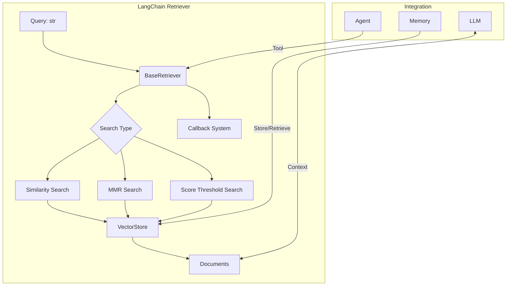
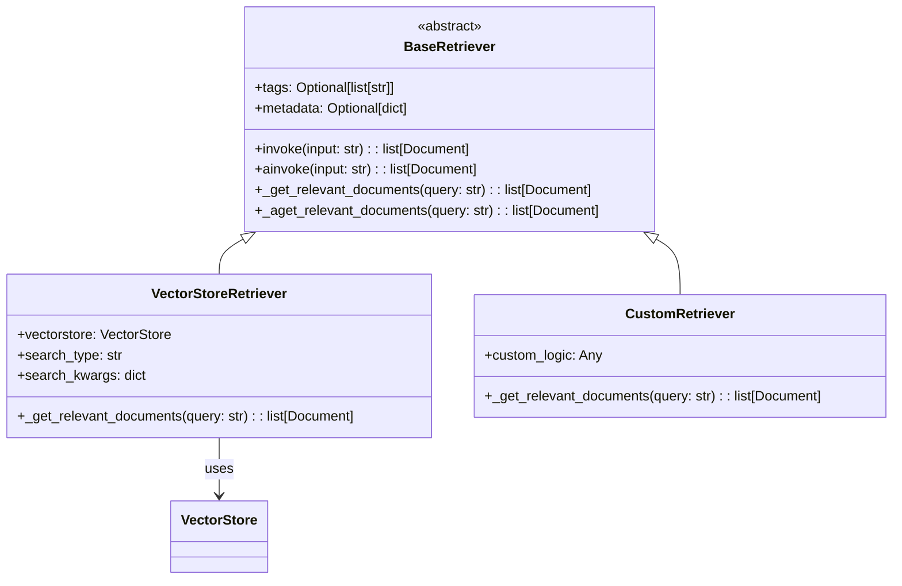
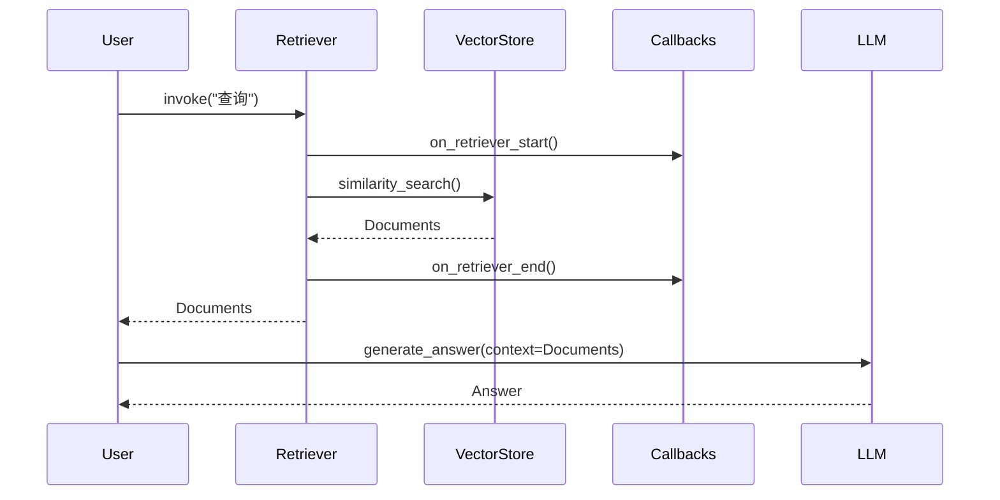

# LangChain 检索器 (Retrievers) 综合指南

## 1. What - 什么是Retrievers？

### 1.1 基本概念

检索器（Retriever）是LangChain中的一个核心组件，它提供了一个通用接口，用于根据文本查询返回相关的文档。检索器比向量存储更加通用，它不需要能够存储文档，只需要能够返回（或检索）文档。向量存储可以用作检索器的后端，但也存在其他类型的检索器。

**核心定义：** 检索器是一个函数，它接受一个字符串查询并返回一组相关文档。

### 1.2 与向量存储的关系

检索器与向量存储密切相关，但它们是不同的概念：

- **向量存储（Vector Store）**：负责存储嵌入数据并执行向量搜索
- **检索器（Retriever）**：提供统一的接口，将查询转换为相关文档的检索过程

向量存储可以通过 `as_retriever()` 方法转换为检索器，从而成为检索器的后端实现。

## 2. Why - 为什么需要Retrievers？

### 2.1 解决LLM的局限性

语言模型存在以下局限性，而检索器能够有效解决：

- **知识过时**：LLM的知识截止于训练时间，无法获取最新信息
- **上下文不足**：无法访问特定领域的专有数据
- **幻觉问题**：在缺乏事实依据时可能生成不准确的内容

### 2.2 RAG系统的核心组件

检索器是RAG（检索增强生成，Retrieval-Augmented Generation）系统的关键组件：

```
用户查询 → 检索器 → 相关文档 → LLM → 生成答案
```

通过这种方式，LLM可以基于特定上下文生成更准确、更相关的响应。

### 2.3 统一接口设计

检索器提供了一个统一的接口，使得不同类型的检索系统可以以一致的方式使用：

- 向量存储检索器
- 关键词检索器
- 混合检索器
- 专用API检索器

## 3. How - 如何使用和实现Retrievers？

### 3.1 核心架构

#### 3.1.1 BaseRetriever 抽象基类

```python
from langchain_core.retrievers import BaseRetriever
from langchain_core.documents import Document

class BaseRetriever(RunnableSerializable[RetrieverInput, RetrieverOutput], ABC):
    """检索系统的抽象基类"""
    
    @abstractmethod
    def _get_relevant_documents(
        self, query: str, *, run_manager: CallbackManagerForRetrieverRun
    ) -> list[Document]:
        """获取与查询相关的文档"""
        pass
    
    async def _aget_relevant_documents(
        self, query: str, *, run_manager: AsyncCallbackManagerForRetrieverRun
    ) -> list[Document]:
        """异步获取与查询相关的文档"""
        pass
```

#### 3.1.2 主要方法

- `invoke()` / `ainvoke()`: 同步/异步调用检索器
- `batch()` / `abatch()`: 批量处理多个查询
- `_get_relevant_documents()`: 子类必须实现的核心检索逻辑
- `_aget_relevant_documents()`: 可选的异步原生实现

### 3.2 实现自定义检索器

```python
from langchain_core.retrievers import BaseRetriever
from langchain_core.documents import Document

class SimpleRetriever(BaseRetriever):
    """简单检索器示例"""
    docs: list[Document]
    k: int = 5

    def _get_relevant_documents(self, query: str) -> list[Document]:
        """返回文档列表中的前k个文档"""
        return self.docs[:self.k]

    async def _aget_relevant_documents(self, query: str) -> list[Document]:
        """异步实现"""
        return self.docs[:self.k]
```

### 3.3 VectorStoreRetriever

VectorStoreRetriever是VectorStore和Retriever之间的桥梁：

```python
# 从向量存储创建检索器
vectorstore = MyVectorStore()
retriever = vectorstore.as_retriever()

# 配置检索器参数
retriever = vectorstore.as_retriever(
    search_type="similarity",  # 搜索类型
    search_kwargs={"k": 5}     # 搜索参数
)
```

### 3.4 搜索类型详解

#### 3.4.1 相似度搜索 (similarity)
```python
# 最基本的向量相似度搜索
retriever = vectorstore.as_retriever(search_type="similarity")
```

#### 3.4.2 最大边际相关性 (MMR)
```python
# 平衡相关性和多样性
retriever = vectorstore.as_retriever(
    search_type="mmr",
    search_kwargs={
        "k": 5,           # 返回文档数量
        "fetch_k": 20,    # MMR算法考虑的文档数量
        "lambda_mult": 0.5 # 多样性参数 (0-1)
    }
)
```

#### 3.4.3 相似度阈值搜索
```python
# 只返回相似度高于阈值的文档
retriever = vectorstore.as_retriever(
    search_type="similarity_score_threshold",
    search_kwargs={"score_threshold": 0.8}
)
```

### 3.5 检索器工具

检索器可以轻松转换为工具，供Agent使用：

```python
from langchain_core.tools import create_retriever_tool

retriever_tool = create_retriever_tool(
    retriever,
    "search_knowledge_base",
    "用于搜索知识库的检索工具"
)
```

## 4. 技术架构图

### 4.1 整体架构图



### 4.2 类继承关系图



### 4.3 调用时序图



## 5. 检索器类型详解

### 5.1 VectorStoreRetriever

这是最常见的检索器类型，基于向量存储实现：

```python
# 从向量存储创建检索器
retriever = vectorstore.as_retriever(
    search_type="similarity",  # 默认搜索类型
    search_kwargs={
        "k": 4,  # 返回文档数量
        "filter": {"source": "specific_source"}  # 元数据过滤
    }
)
```

### 5.2 EnsembleRetriever

组合多个检索器的结果：

```python
from langchain.retrievers import EnsembleRetriever

# 组合BM25和向量存储检索器
ensemble_retriever = EnsembleRetriever(
    retrievers=[bm25_retriever, vector_store_retriever], 
    weights=[0.5, 0.5]
)
```

### 5.3 MergerRetriever

合并多个检索器的结果：

```python
from langchain.retrievers import MergerRetriever

# 合并多个检索器的文档
merger_retriever = MergerRetriever(
    retrievers=[retriever1, retriever2, retriever3]
)
```

### 5.4 ParentDocumentRetriever

处理大文档的检索：

```python
from langchain.retrievers import ParentDocumentRetriever

# 存储大文档，检索小块，返回完整父文档
retriever = ParentDocumentRetriever(
    vectorstore=vectorstore,
    doc_store=doc_store,
    child_splitter=child_splitter,
    parent_splitter=parent_splitter
)
```

## 6. 实际应用示例

### 6.1 基础使用示例

```python
from langchain_openai import OpenAIEmbeddings
from langchain_community.vectorstores import Chroma
from langchain_core.documents import Document

# 创建文档
docs = [
    Document(page_content="Python是一种编程语言", metadata={"source": "python"}),
    Document(page_content="机器学习是AI的分支", metadata={"source": "ml"}),
    Document(page_content="深度学习使用神经网络", metadata={"source": "dl"})
]

# 创建向量存储
embeddings = OpenAIEmbeddings()
vectorstore = Chroma.from_documents(docs, embeddings)

# 创建检索器
retriever = vectorstore.as_retriever(
    search_type="similarity",
    search_kwargs={"k": 2}
)

# 使用检索器
results = retriever.invoke("编程语言")
print(results)
```

### 6.2 高级配置示例

```python
# 使用MMR搜索避免重复结果
mmr_retriever = vectorstore.as_retriever(
    search_type="mmr",
    search_kwargs={
        "k": 5,
        "fetch_k": 20,
        "lambda_mult": 0.25  # 更注重多样性
    }
)

# 使用相似度阈值过滤
threshold_retriever = vectorstore.as_retriever(
    search_type="similarity_score_threshold",
    search_kwargs={"score_threshold": 0.7}
)
```

### 6.3 与Agent集成

```python
from langchain.tools import create_retriever_tool
from langchain.agents import AgentExecutor, create_openai_tools_agent

# 创建检索工具
retriever_tool = create_retriever_tool(
    retriever,
    "knowledge_base_search",
    "用于搜索知识库的工具，当需要特定事实信息时使用"
)

# 创建Agent
tools = [retriever_tool]
# ... 创建并运行Agent
```

## 7. 设计思想与核心实现

### 7.1 设计模式应用

1. **适配器模式**：VectorStoreRetriever将VectorStore适配为Retriever接口
2. **模板方法模式**：BaseRetriever定义了算法骨架，子类实现具体逻辑
3. **策略模式**：支持多种搜索策略（similarity, mmr, score_threshold）

### 7.2 可扩展性设计

- **回调系统**：支持监控和追踪
- **异步支持**：同步和异步方法并存
- **配置灵活性**：通过search_kwargs支持各种参数配置
- **类型安全**：使用Pydantic进行参数验证

### 7.3 性能优化

- **异步执行**：支持异步操作以提高性能
- **批处理支持**：支持批量处理多个查询
- **缓存机制**：可与缓存系统集成

## 8. 最佳实践

### 8.1 选择合适的搜索类型

- **similarity**：适用于一般场景
- **mmr**：当需要结果多样性时
- **similarity_score_threshold**：当需要质量控制时

### 8.2 参数调优

- `k`：根据应用场景调整返回文档数量
- `score_threshold`：平衡精确度和召回率
- `lambda_mult`：在MMR中平衡相关性和多样性

### 8.3 错误处理

```python
try:
    results = retriever.invoke(query)
except Exception as e:
    # 处理检索错误
    print(f"检索失败: {e}")
    # 可以提供备选方案或默认响应
```

## 9. 常见问题与解决方案

### 9.1 检索结果不相关

**原因**：嵌入质量、查询与文档语言不匹配
**解决方案**：
- 优化文档预处理
- 使用更好的嵌入模型
- 调整搜索参数

### 9.2 检索性能问题

**原因**：向量存储规模大、查询频率高
**解决方案**：
- 使用索引优化
- 实现缓存机制
- 考虑分布式向量存储

## 10. 总结

Retrievers是LangChain中不可或缺的核心组件，它们提供了一个统一而灵活的接口，用于从各种数据源检索相关信息。通过将查询转换为相关文档的检索过程，Retrievers使LLM能够基于特定上下文生成更准确、更相关的响应，是构建高效RAG系统的关键。

Retrievers的设计体现了良好的软件工程原则，包括清晰的抽象接口、灵活的配置选项、强大的可扩展性以及与其他LangChain组件的无缝集成。无论是简单的向量存储检索还是复杂的多策略组合检索，Retrievers都能提供相应的解决方案，是现代AI应用开发的重要工具。