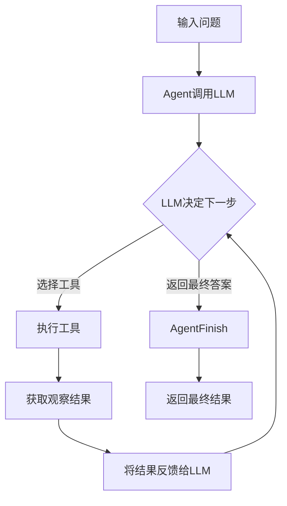
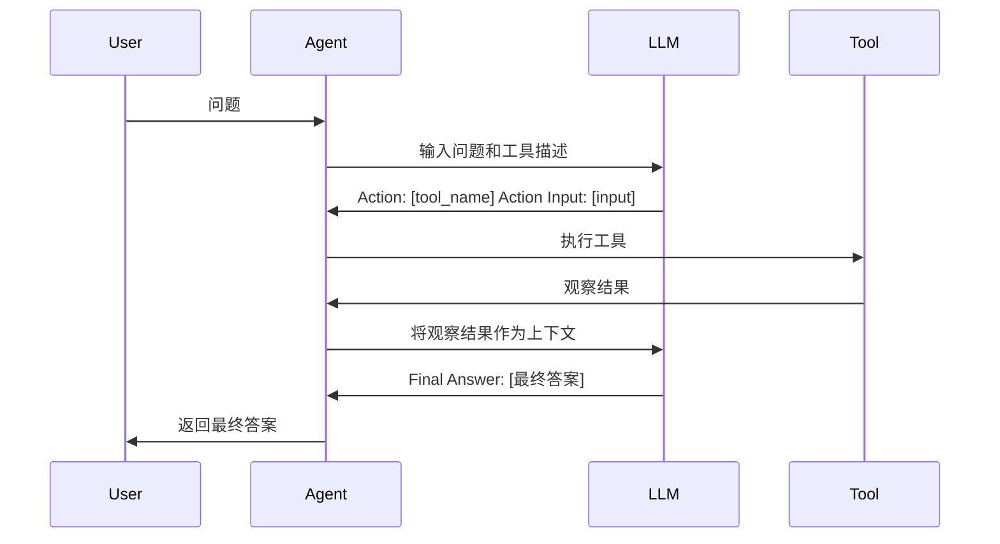
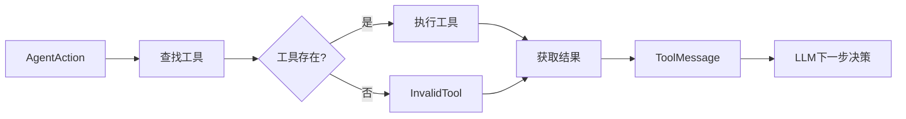

# LangChain Agents 全面解析：从原理到实践

## 1. What - 什么是LangChain Agents

LangChain Agents是能够自主决定使用哪些工具来完成任务的智能体。它们使用语言模型来选择要执行的操作序列，而不是遵循固定的预定义流程。Agent的核心在于它能够根据当前状态和输入来动态地决定下一步行动。

在传统的LangChain应用中，开发者需要预先定义固定的执行流程。而使用Agent时，语言模型本身负责决定执行哪些步骤。这使得系统能够处理更复杂的、非线性的任务，特别是在需要根据中间结果做出决策的情况下。

## 2. Why - 为什么需要LangChain Agents

传统的方法在处理复杂任务时存在以下局限：

1. **固定流程**：预定义的流程无法应对需要动态决策的场景
2. **扩展性差**：添加新的决策分支会使代码变得复杂
3. **适应性弱**：无法根据输入内容动态调整处理策略

Agent通过以下方式解决了这些问题：

1. **动态决策**：能够根据中间结果动态选择下一步操作
2. **模块化设计**：工具可以独立开发和维护
3. **可扩展性**：添加新工具不需要修改核心逻辑
4. **适应性**：能够处理未预见的输入和场景

## 3. How - LangChain Agents如何工作

### 3.1 核心组件

#### AgentAction
```python
class AgentAction(Serializable):
    """Represents a request to execute an action by an agent."""
    tool: str  # 要执行的工具名称
    tool_input: Union[str, dict]  # 传递给工具的输入
    log: str  # 用于记录额外信息
    type: Literal["AgentAction"] = "AgentAction"
```

#### AgentFinish
```python
class AgentFinish(Serializable):
    """Final return value of an ActionAgent."""
    return_values: dict  # 返回值
    log: str  # 用于记录的额外信息
    type: Literal["AgentFinish"] = "AgentFinish"
```

#### AgentStep
```python
class AgentStep(Serializable):
    """Result of running an AgentAction."""
    action: AgentAction  # 执行的AgentAction
    observation: Any  # AgentAction的结果
```

### 3.2 Agent执行流程



### 3.3 AgentExecutor执行机制

AgentExecutor是Agent的执行器，负责管理整个执行循环：

1. **初始化**：接收输入，设置初始状态
2. **循环执行**：
   - 调用Agent的plan方法获取下一步行动
   - 如果是AgentAction，执行对应的工具
   - 如果是AgentFinish，结束并返回结果
   - 更新中间步骤
3. **迭代控制**：检查是否达到最大迭代次数或时间限制
4. **结果返回**：返回最终结果

```python
def _call(
    self,
    inputs: dict[str, str],
    run_manager: Optional[CallbackManagerForChainRun] = None,
) -> dict[str, Any]:
    # 构建工具映射
    name_to_tool_map = {tool.name: tool for tool in self.tools}
    # 颜色映射用于日志
    color_mapping = get_color_mapping(
        [tool.name for tool in self.tools],
        excluded_colors=["green", "red"],
    )
    intermediate_steps: list[tuple[AgentAction, str]] = []
    iterations = 0
    time_elapsed = 0.0
    start_time = time.time()
    
    # 进入执行循环
    while self._should_continue(iterations, time_elapsed):
        next_step_output = self._take_next_step(
            name_to_tool_map,
            color_mapping,
            inputs,
            intermediate_steps,
            run_manager=run_manager,
        )
        if isinstance(next_step_output, AgentFinish):
            return self._return(
                next_step_output,
                intermediate_steps,
                run_manager=run_manager,
            )

        intermediate_steps.extend(next_step_output)
        if len(next_step_output) == 1:
            next_step_action = next_step_output[0]
            # 检查工具是否直接返回结果
            tool_return = self._get_tool_return(next_step_action)
            if tool_return is not None:
                return self._return(
                    tool_return,
                    intermediate_steps,
                    run_manager=run_manager,
                )
        iterations += 1
        time_elapsed = time.time() - start_time
```

## 4. 不同类型Agents的实现原理

### 4.1 MRKL (Zero Shot ReAct) Agent

MRKL Agent基于ReAct框架，使用固定的提示格式来引导模型进行推理和行动：



### 4.2 ReAct Agent

ReAct Agent结合了推理(Reasoning)和行动(Acting)的过程：

```python
def create_react_agent(
    llm: BaseLanguageModel,
    tools: Sequence[BaseTool],
    prompt: BasePromptTemplate,
):
    return (
        RunnablePassthrough.assign(
            agent_scratchpad=lambda x: format_log_to_str(x["intermediate_steps"]),
        )
        | prompt
        | llm_with_stop
        | ReActSingleInputOutputParser()
    )
```

### 4.3 Tool Calling Agent

现代Tool Calling Agent利用LLM的原生工具调用能力：

```python
def create_tool_calling_agent(
    llm: BaseLanguageModel,
    tools: Sequence[BaseTool],
    prompt: ChatPromptTemplate,
):
    llm_with_tools = llm.bind_tools(tools)
    return (
        RunnablePassthrough.assign(
            agent_scratchpad=lambda x: format_to_tool_messages(x["intermediate_steps"]),
        )
        | prompt
        | llm_with_tools
        | ToolsAgentOutputParser()
    )
```

## 5. 工具交互机制

### 5.1 BaseTool抽象

```python
class BaseTool(RunnableSerializable[Union[str, dict, ToolCall], Any]):
    name: str  # 工具名称
    description: str  # 工具描述
    args_schema: Optional[ArgsSchema] = Field(default=None)  # 参数模式
    return_direct: bool = False  # 是否直接返回结果
    verbose: bool = False  # 是否记录详细日志
    handle_tool_error: Optional[Union[bool, str, Callable[[ToolException], str]]] = False
```

### 5.2 工具执行流程



## 6. 输出解析器机制

### 6.1 MRKL输出解析

```python
class MRKLOutputParser(AgentOutputParser):
    def parse(self, text: str) -> Union[AgentAction, AgentFinish]:
        includes_answer = FINAL_ANSWER_ACTION in text
        regex = r"Action\s*\d*\s*:[\s]*(.*?)[\s]*Action\s*\d*\s*Input\s*\d*\s*:[\s]*(.*)"
        action_match = re.search(regex, text, re.DOTALL)
        
        if action_match:
            action = action_match.group(1).strip()
            action_input = action_match.group(2)
            tool_input = action_input.strip(" ").strip('"')
            return AgentAction(action, tool_input, text)
        
        if includes_answer:
            return AgentFinish(
                {"output": text.split(FINAL_ANSWER_ACTION)[-1].strip()},
                text,
            )
```

### 6.2 工具调用输出解析

```python
def parse_ai_message_to_tool_action(
    message: BaseMessage,
) -> Union[list[AgentAction], AgentFinish]:
    if message.tool_calls:
        tool_calls = message.tool_calls
    else:
        if not message.additional_kwargs.get("tool_calls"):
            return AgentFinish(
                return_values={"output": message.content},
                log=str(message.content),
            )
        # 解析工具调用
        for tool_call in tool_calls:
            function_name = tool_call["name"]
            _tool_input = tool_call["args"]
            tool_input = _tool_input.get("__arg1", _tool_input)
            return ToolAgentAction(
                tool=function_name,
                tool_input=tool_input,
                log=log,
                message_log=[message],
                tool_call_id=tool_call["id"],
            )
```

## 7. 传统Agents vs 现代LangGraph Agents

### 7.1 传统Agents的局限性

1. **固定执行流程**：依赖预定义的循环结构
2. **状态管理复杂**：中间状态难以持久化
3. **错误处理困难**：缺乏恢复机制
4. **扩展性差**：添加新功能需要修改核心逻辑

### 7.2 LangGraph的优势

1. **图结构**：节点和边定义灵活的工作流
2. **状态管理**：内置状态持久化和检查点
3. **多智能体**：支持复杂的多智能体交互
4. **容错性**：内置错误恢复和重试机制

```python
# LangGraph示例
from langgraph.graph import StateGraph, MessagesState, START, END

def agent_1(state: MessagesState) -> Command[Literal["agent_2", "agent_3", END]]:
    response = model.invoke(state["messages"])
    return Command(
        goto=response["next_agent"],
        update={"messages": [response["content"]]}
    )

builder = StateGraph(MessagesState)
builder.add_node(agent_1)
builder.add_node(agent_2)
builder.add_node(agent_3)
builder.add_edge(START, "agent_1")
network = builder.compile()
```

## 8. 核心设计思想和最佳实践

### 8.1 设计思想

1. **可观察性**：每个步骤都可被监控和调试
2. **可恢复性**：支持从检查点恢复执行
3. **可组合性**：组件可以灵活组合
4. **可扩展性**：易于添加新工具和功能

### 8.2 最佳实践

1. **工具设计**：提供清晰的描述和参数验证
2. **错误处理**：实现适当的错误处理和回退机制
3. **迭代控制**：设置合理的最大迭代次数
4. **日志记录**：记录中间步骤便于调试

## 9. 示例代码

### 9.1 基础Agent实现

```python
from langchain.agents import AgentType, initialize_agent, Tool
from langchain.tools import BaseTool
from langchain.llms import OpenAI

# 定义工具
def multiply(a: int, b: int) -> int:
    """Multiply two numbers."""
    return a * b

# 创建工具
tools = [
    Tool(
        name="Calculator",
        func=multiply,
        description="Useful for multiplying two numbers"
    )
]

# 初始化agent
llm = OpenAI(temperature=0)
agent = initialize_agent(
    tools, 
    llm, 
    agent=AgentType.ZERO_SHOT_REACT_DESCRIPTION,
    verbose=True
)

# 执行
result = agent.run("What is 21 times 42?")
print(result)
```

### 9.2 现代Tool Calling Agent

```python
from langchain_openai import ChatOpenAI
from langgraph.prebuilt import create_tool_calling_agent
from langchain_core.tools import tool
from langchain_core.prompts import ChatPromptTemplate

@tool
def get_current_weather(location: str) -> str:
    """Get the current weather in a given location."""
    return f"The weather in {location} is sunny with 22°C."

tools = [get_current_weather]
llm = ChatOpenAI(model="gpt-3.5-turbo")

prompt = ChatPromptTemplate.from_messages([
    ("system", "You are a helpful assistant"),
    ("human", "{input}"),
    ("placeholder", "{agent_scratchpad}")
])

agent = create_tool_calling_agent(llm, tools, prompt)
```

## 10. 总结

LangChain Agents提供了一种强大的机制，使语言模型能够自主决定如何使用工具来完成任务。从传统的基于循环的Agent到现代基于图的LangGraph，这一领域经历了显著的发展。

核心要点：
- Agent通过动态决策处理复杂任务
- 工具交互机制使Agent能够扩展能力
- 现代LangGraph提供了更灵活的状态管理和多智能体支持
- 合理的设计模式和最佳实践确保系统的可维护性

随着AI系统变得越来越复杂，Agent模式将在构建智能应用中发挥越来越重要的作用。