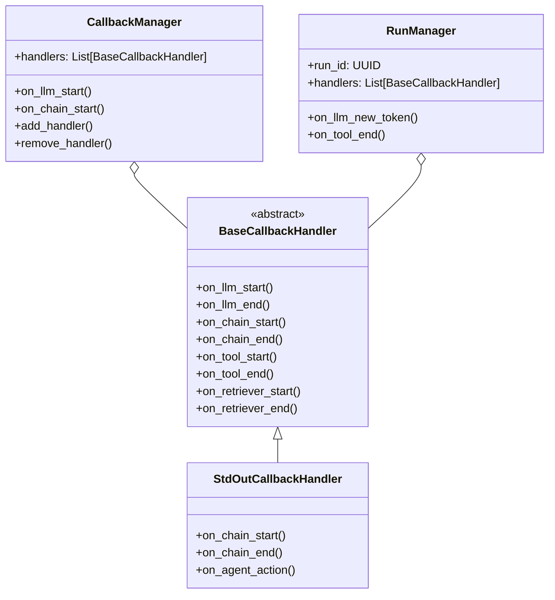
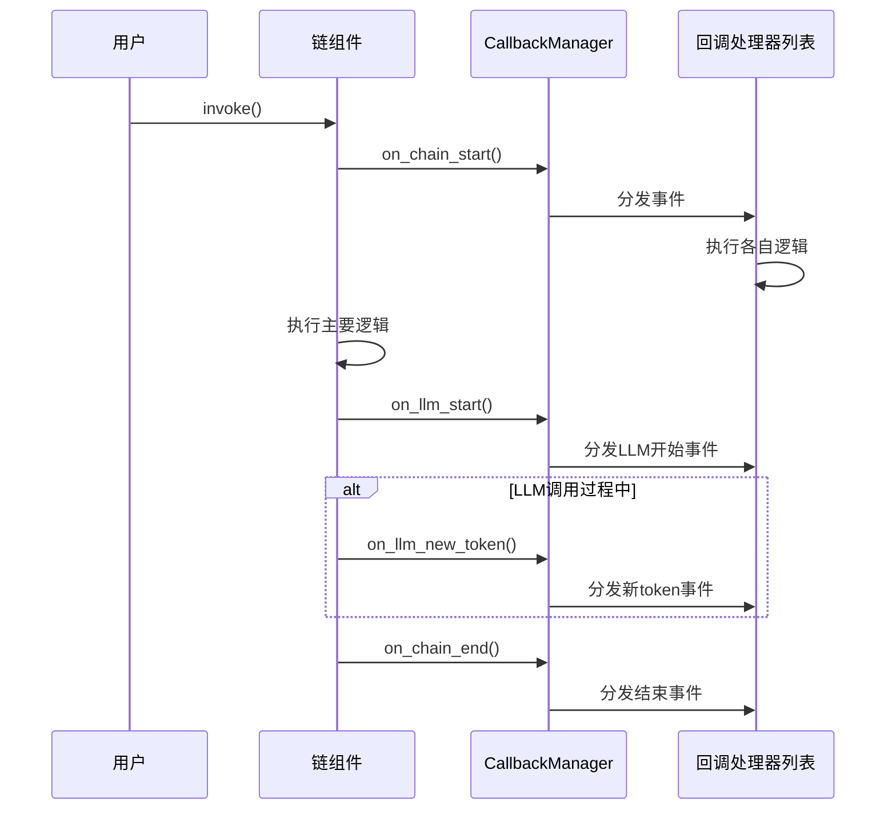
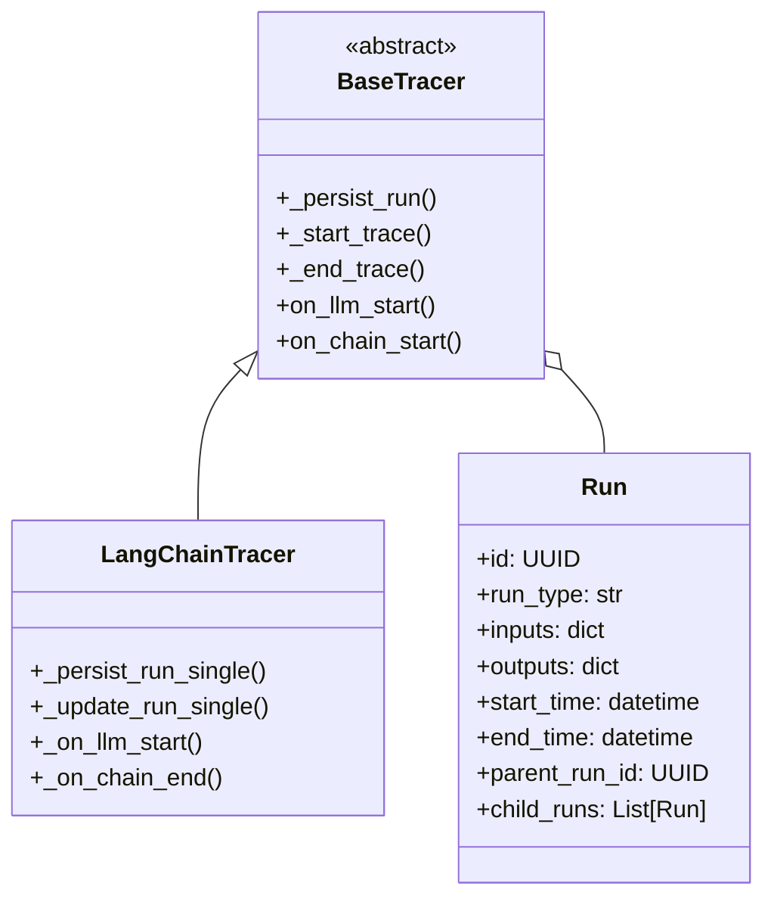
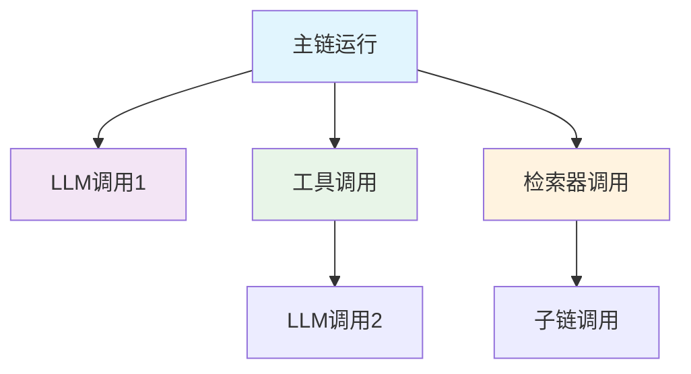
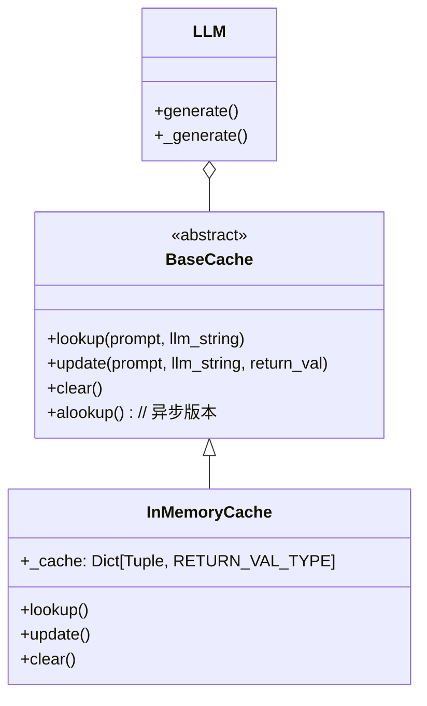
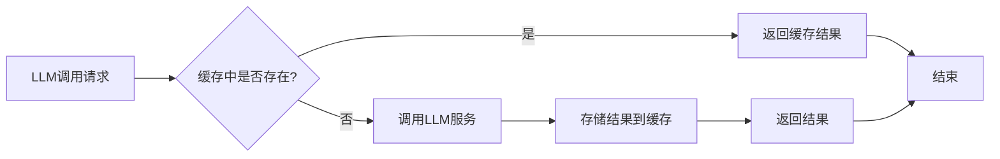

# LangChain运行时与监控系统深度解析：回调、追踪与缓存

## What - 什么是LangChain运行时与监控系统？

LangChain运行时与监控系统是LangChain框架中用于监控、调试和优化AI应用运行过程的核心组件。它主要包含三个部分：

1. **回调系统（Callbacks）**：提供事件监听机制，允许开发者在LangChain组件运行的各个阶段插入自定义逻辑
2. **追踪系统（Tracers）**：记录和可视化AI应用的执行流程，帮助调试和分析
3. **缓存系统（Caches）**：通过缓存LLM调用结果来优化性能和降低成本

这个系统就像是一个智能监控中心，可以观察、记录和优化AI应用的运行过程。

## Why - 为什么需要运行时与监控系统？

### 1. 调试和问题排查
- **问题定位**：当AI应用出现问题时，能够快速定位问题所在环节
- **状态监控**：实时了解各个组件的运行状态
- **错误追踪**：记录错误发生的具体位置和上下文

### 2. 性能优化
- **耗时分析**：识别性能瓶颈，优化慢速组件
- **成本控制**：通过缓存减少重复的LLM调用，节省API费用
- **资源管理**：了解系统资源使用情况

### 3. 用户体验
- **进度反馈**：向用户展示AI应用的执行进度
- **结果验证**：确保AI应用按预期运行
- **透明度**：提高AI应用的可解释性

### 4. 开发效率
- **快速迭代**：通过监控数据快速验证改进效果
- **自动化测试**：基于监控数据进行回归测试

## How - 如何实现运行时与监控？

### 1. 回调系统（Callbacks）

#### 核心架构

回调系统采用事件驱动的观察者模式，其核心架构如下：

```
[LangChain组件] --> [回调管理器] --> [多个回调处理器]
```

回调系统的主要组件包括：

- **BaseCallbackHandler**：所有回调处理器的基类，定义了所有可能的回调方法
- **CallbackManager**：回调管理器，负责分发回调事件到所有注册的处理器
- **RunManager**：运行管理器，为特定运行实例提供回调接口

#### 实现原理



#### 事件生命周期



#### 大白话解释

回调系统就像一个"监控室"，它在AI应用运行的每个关键节点都设置了"监控探头"：

- 当LLM开始运行时，监控室会收到"LLM开始运行"的通知
- 当LLM产生新token时，监控室会收到"新token产生"的通知
- 当链式调用结束时，监控室会收到"链结束"的通知

开发者可以自定义"监控探头"（回调处理器），告诉系统在收到特定通知时要做什么。比如：
- 在控制台打印信息
- 将信息记录到数据库
- 发送通知给用户

### 2. 追踪系统（Tracers）

#### 核心架构

追踪系统是回调系统的一个特殊应用，专注于记录和可视化执行流程：



#### 实现原理

追踪系统通过以下方式工作：

1. **构建执行树**：将所有组件调用组织成树形结构
2. **记录详细信息**：捕获每个组件的输入、输出、执行时间等
3. **持久化存储**：将执行信息保存到外部系统（如LangSmith）



#### 大白话解释

追踪系统就像一个"行车记录仪"，它记录AI应用运行的全过程：

- 每个组件调用都是一次"事件"
- 事件之间有父子关系，形成一棵"执行树"
- 每个事件都记录了：谁调用了什么、输入了什么、输出了什么、耗时多久
- 所有记录可以保存起来，供后续分析使用

### 3. 缓存系统（Caches）

#### 核心架构

缓存系统提供了一种机制来存储和复用LLM调用的结果：



#### 实现原理

缓存系统的工作流程如下：



#### 大白话解释

缓存系统就像一个"记忆库"：

- 当AI应用问了"同样的问题"（相同的输入和LLM配置），系统直接从记忆库中拿出上次的答案
- 只有遇到"新问题"时，才真正去调用LLM服务
- 这样既节省了费用，又提高了响应速度

## 核心设计思想分析

### 1. 事件驱动架构
- **松耦合**：组件与监控逻辑解耦，通过事件进行通信
- **可扩展**：可以轻松添加新的回调处理器
- **非侵入**：不修改原有组件逻辑

### 2. 组合模式
- **多重继承**：通过多个mixin类组合出功能完整的回调处理器
- **职责分离**：每个mixin负责特定类型的事件

### 3. 抽象工厂模式
- **统一接口**：所有缓存实现都遵循BaseCache接口
- **策略模式**：根据不同场景选择不同缓存策略

### 4. 观察者模式
- **一对多**：一个事件源可以通知多个观察者
- **动态注册**：运行时可以添加或移除观察者

## 核心实现分析

### 回调系统核心实现

```python
# 核心事件分发机制
def handle_event(
    handlers: list[BaseCallbackHandler],
    event_name: str,
    ignore_condition_name: Optional[str],
    *args: Any,
    **kwargs: Any,
) -> None:
    """通用事件处理器"""
    coros: list[Coroutine[Any, Any, Any]] = []
    
    for handler in handlers:
        try:
            # 检查是否应该忽略此事件
            if ignore_condition_name is None or not getattr(
                handler, ignore_condition_name
            ):
                # 执行回调方法
                event = getattr(handler, event_name)(*args, **kwargs)
                if asyncio.iscoroutine(event):
                    coros.append(event)
        except NotImplementedError:
            # 处理未实现的方法
            pass
        except Exception as e:
            # 错误处理
            pass
    finally:
        # 处理异步回调
        if coros:
            # 异步执行逻辑
            pass
```

### 追踪系统核心实现

```python
class _TracerCore(ABC):
    """追踪系统核心实现"""
    
    def __init__(self):
        self.run_map: dict[str, Run] = {}  # 运行ID到运行对象的映射
        self.order_map: dict[UUID, tuple[UUID, str]] = {}  # 运行ID到顺序的映射
    
    def _start_trace(self, run: Run) -> None:
        """开始追踪一个运行"""
        current_dotted_order = run.start_time.strftime("%Y%m%dT%H%M%S%fZ") + str(run.id)
        
        if run.parent_run_id:
            # 如果有父运行，建立父子关系
            if parent := self.order_map.get(run.parent_run_id):
                run.trace_id, run.dotted_order = parent
                run.dotted_order += "." + current_dotted_order
                if parent_run := self.run_map.get(str(run.parent_run_id)):
                    self._add_child_run(parent_run, run)
        else:
            # 没有父运行，作为根运行
            run.trace_id = run.id
            run.dotted_order = current_dotted_order
            
        # 注册运行
        self.order_map[run.id] = (run.trace_id, run.dotted_order)
        self.run_map[str(run.id)] = run
```

### 缓存系统核心实现

```python
class BaseCache(ABC):
    """缓存系统基类"""
    
    @abstractmethod
    def lookup(self, prompt: str, llm_string: str) -> Optional[RETURN_VAL_TYPE]:
        """查找缓存"""
        pass
    
    @abstractmethod
    def update(self, prompt: str, llm_string: str, return_val: RETURN_VAL_TYPE) -> None:
        """更新缓存"""
        pass

class InMemoryCache(BaseCache):
    """内存缓存实现"""
    
    def __init__(self, *, maxsize: Optional[int] = None) -> None:
        self._cache: dict[tuple[str, str], RETURN_VAL_TYPE] = {}
        self._maxsize = maxsize
    
    def lookup(self, prompt: str, llm_string: str) -> Optional[RETURN_VAL_TYPE]:
        """查找缓存实现"""
        return self._cache.get((prompt, llm_string), None)
    
    def update(self, prompt: str, llm_string: str, return_val: RETURN_VAL_TYPE) -> None:
        """更新缓存实现"""
        if self._maxsize is not None and len(self._cache) == self._maxsize:
            # 实现LRU策略，删除最老的项
            del self._cache[next(iter(self._cache))]
        self._cache[prompt, llm_string] = return_val
```

## 实际应用示例

### 1. 使用回调系统

```python
from langchain_core.callbacks import StdOutCallbackHandler
from langchain_core.callbacks.manager import CallbackManager

# 创建回调管理器
callback_manager = CallbackManager([StdOutCallbackHandler()])

# 在链中使用回调
result = chain.invoke({"input": "Hello"}, {"callbacks": callback_manager})
```

### 2. 使用追踪系统

```python
from langchain_core.tracers import LangChainTracer

# 配置追踪器
tracer = LangChainTracer()
result = chain.invoke({"input": "Hello"}, {"callbacks": [tracer]})
```

### 3. 使用缓存系统

```python
from langchain_core.caches import InMemoryCache

# 配置缓存
cache = InMemoryCache(maxsize=1000)
# 在LLM中使用缓存（通常通过全局配置）
```

## 总结

LangChain的运行时与监控系统是一个精心设计的组件，它通过回调、追踪和缓存三个维度，为AI应用提供了全方位的监控和优化能力。

- **回调系统**提供了灵活的事件监听机制，允许开发者在运行时插入自定义逻辑
- **追踪系统**提供了可视化的执行流程记录，便于调试和分析
- **缓存系统**提供了性能优化机制，通过复用结果降低成本

这个系统的设计体现了良好的软件工程原则：高内聚、低耦合、可扩展、可复用，为AI应用的开发、调试和优化提供了强大支持。