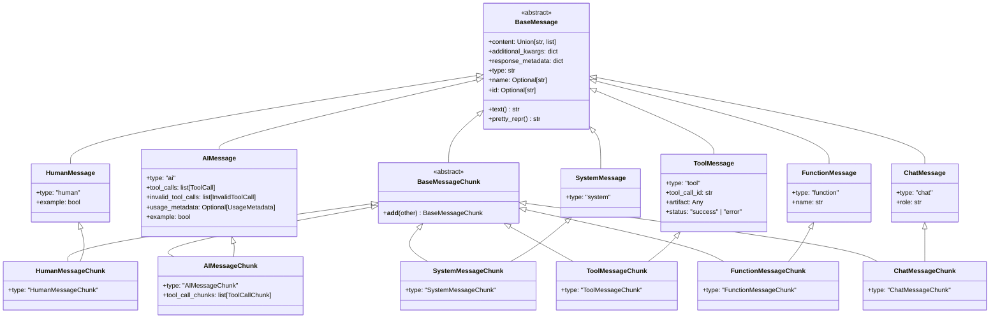
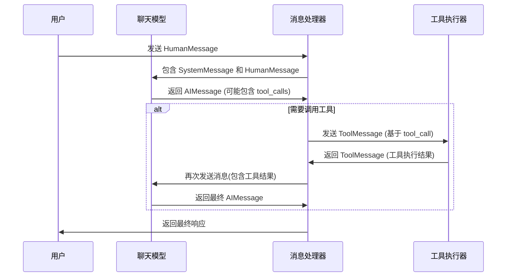
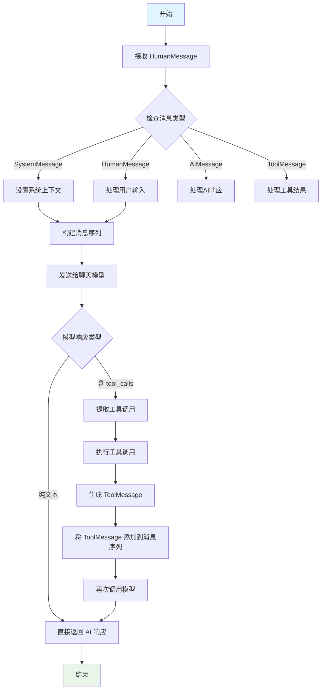

# LangChain Core 消息系统全面指南

## 目录
1. [消息系统概述](#消息系统概述)
2. [整体架构](#整体架构)
3. [消息类型详解](#消息类型详解)
4. [技术原理 (What, Why, How)](#技术原理)
5. [消息处理流程](#消息处理流程)
6. [示例代码](#示例代码)
7. [最佳实践](#最佳实践)

## 消息系统概述

LangChain消息系统是LangChain框架中用于表示和管理对话中各种消息的核心组件。它提供了一套统一的消息对象（如HumanMessage、AIMessage、SystemMessage等），用于在聊天模型和应用程序之间传递信息。

想象一下，你正在和一个智能助手聊天。每次你说一句话，助手就会回复你。在这个过程中，你们的对话会形成一个序列：你说的话、助手的回复、你再回应，如此循环。LangChain的消息系统就是用来管理这种对话序列的工具。

### 核心消息类型：
- **BaseMessage**: 所有消息类型的基类，定义了消息的基本结构
- **HumanMessage**: 表示用户发送的消息
- **AIMessage**: 表示AI模型返回的消息
- **SystemMessage**: 为AI模型提供系统级指令或上下文
- **ToolMessage**: 表示工具执行结果的消息
- **FunctionMessage**: 旧版的工具结果消息（现在推荐使用ToolMessage）
- **ChatMessage**: 可指定任意角色的消息

## 整体架构

### 架构图



### 消息流转时序图



### 消息处理流程图



## 消息类型详解

### 1. HumanMessage - 用户消息

HumanMessage代表用户发送的消息，就像你向助手提问"今天天气怎么样？"。

**比喻理解**：就像在微信聊天中，你发送的每一条消息。

**代码示例**：
```python
from langchain_core.messages import HumanMessage

# 创建用户消息
user_message = HumanMessage(content="今天天气怎么样？")
print(f"用户说：{user_message.content}")
```

### 2. AIMessage - AI消息

AIMessage代表AI模型的回复，比如AI回复"今天天气晴朗，温度20度"。

**比喻理解**：就像在微信聊天中，朋友回复你的消息。

**代码示例**：
```python
from langchain_core.messages import AIMessage

# 创建AI消息
ai_message = AIMessage(content="今天天气晴朗，温度20度")
print(f"AI说：{ai_message.content}")
```

### 3. SystemMessage - 系统消息

SystemMessage用于给AI提供系统级指令或上下文，比如"你是一个天气查询助手"。

**比喻理解**：就像给新员工的入职培训，告诉AI它的角色和任务。

**代码示例**：
```python
from langchain_core.messages import SystemMessage

# 创建系统消息
system_message = SystemMessage(content="你是一个专业的天气查询助手")
print(f"系统指令：{system_message.content}")
```

### 4. ToolMessage - 工具消息

ToolMessage用于传递工具执行的结果给AI，比如天气API返回的详细数据。

**比喻理解**：就像助手去查询天气网站后，把查询结果告诉你。

**代码示例**：
```python
from langchain_core.messages import ToolMessage

# 创建工具消息
tool_message = ToolMessage(
    content="北京，晴天，温度20度，湿度45%",
    tool_call_id="call_123"  # 关联到特定的工具调用
)
print(f"工具结果：{tool_message.content}")
```

## 技术原理

### What - 什么是LangChain消息系统？

LangChain消息系统是LangChain框架中用于表示和管理对话中各种消息的核心组件。它提供了一套统一的消息对象（如HumanMessage、AIMessage、SystemMessage等），用于在聊天模型和应用程序之间传递信息。

### Why - 为什么需要消息系统？

#### 1. 标准化接口
聊天模型需要特定格式的输入。消息系统提供了一个标准化的接口，让不同的聊天模型可以使用相同的输入格式。

#### 2. 对话历史管理
AI对话通常需要上下文。消息系统可以保存和管理完整的对话历史，让AI能够理解之前的对话内容。

#### 3. 复杂交互支持
现代AI应用不仅仅是简单的问答，还涉及工具调用、多模态内容、流式响应等。消息系统支持这些复杂交互场景。

#### 4. 类型安全
通过不同的消息类型，开发者可以清楚地知道当前处理的是什么类型的消息，减少错误。

### How - 消息系统是如何工作的？

#### 1. 消息创建与使用
```python
from langchain_core.messages import HumanMessage, AIMessage, SystemMessage

# 创建不同类型的消息
messages = [
    SystemMessage(content="你是一个有用的助手"),
    HumanMessage(content="今天天气怎么样？"),
]
```

#### 2. 消息处理流程
- 用户创建消息序列（通常包括SystemMessage和HumanMessage）
- 消息序列被传递给聊天模型
- 聊天模型返回AIMessage（可能包含工具调用信息）
- 如果有工具调用，执行工具并生成ToolMessage
- 将ToolMessage添加到消息序列中，再次调用模型获得最终响应

#### 3. 消息内容格式
- **简单文本**: `content`字段可以是简单的字符串
- **多模态内容**: `content`字段可以是包含文本、图像等的列表
- **结构化数据**: 支持复杂的JSON格式内容

#### 4. 消息序列化与反序列化
消息系统支持将消息对象序列化为字典格式，也支持从字典反序列化为消息对象，便于存储和传输。

#### 5. 消息过滤与处理
提供了工具函数如`filter_messages`、`trim_messages`等，用于处理消息序列，如过滤特定类型的消息或修剪过长的对话历史。

## 消息处理流程

### 1. 简单对话

最基础的用法是创建一个包含系统指令、用户问题和AI回复的消息序列：

```python
from langchain_core.messages import SystemMessage, HumanMessage, AIMessage

# 创建对话序列
messages = [
    SystemMessage(content="你是一个有用的助手"),
    HumanMessage(content="你好，我是张三"),
    AIMessage(content="你好，张三！有什么可以帮助你的吗？"),
    HumanMessage(content="今天天气怎么样？")
]

# 这个消息序列可以传递给聊天模型
# model.invoke(messages)
```

### 2. 工具调用场景

当AI需要调用工具时，消息系统会记录完整的交互过程：

```python
from langchain_core.messages import (
    SystemMessage, 
    HumanMessage, 
    AIMessage, 
    ToolMessage
)
from langchain_core.messages import ToolCall

# 用户询问天气
messages = [
    SystemMessage(content="你是一个天气查询助手"),
    HumanMessage(content="今天北京天气怎么样？")
]

# AI决定调用天气工具
ai_with_tool_call = AIMessage(
    content="",  # AI可能没有直接回复内容
    tool_calls=[
        ToolCall(
            name="get_weather",
            args={"location": "北京"},
            id="call_123"
        )
    ]
)

# 工具执行后返回结果
tool_result = ToolMessage(
    content="北京今天晴天，温度20度，湿度45%",
    tool_call_id="call_123"
)

# AI基于工具结果给出最终回复
final_response = AIMessage(
    content="北京今天晴天，温度20度，湿度45%。"
)

# 完整的消息序列
full_conversation = messages + [ai_with_tool_call, tool_result, final_response]
```

### 3. 消息过滤

有时候我们只需要特定类型的消息：

```python
from langchain_core.messages import (
    HumanMessage, 
    AIMessage, 
    SystemMessage,
    filter_messages
)

messages = [
    SystemMessage("系统指令", id="1"),
    HumanMessage("用户问题", id="2"),
    AIMessage("AI回复", id="3"),
    HumanMessage("用户追问", id="4"),
    AIMessage("AI回复2", id="5")
]

# 只获取用户消息
human_only = filter_messages(
    messages, 
    include_types=["human"]
)
print("只包含用户消息:", human_only)

# 排除特定ID的消息
exclude_specific = filter_messages(
    messages,
    exclude_ids=["3"]
)
print("排除ID为3的消息:", exclude_specific)
```

### 4. 消息修剪

当对话历史过长时，我们需要修剪消息以控制上下文长度：

```python
from langchain_core.messages import trim_messages

# 假设有很多消息
messages = [
    SystemMessage("系统指令"),
    HumanMessage("问题1"),
    AIMessage("回复1"),
    HumanMessage("问题2"),
    AIMessage("回复2"),
    # ... 更多消息
]

# 保留最后的3个token（这里用消息数量代替）
trimmed_messages = trim_messages(
    messages,
    max_tokens=3,
    token_counter=len,  # 使用消息数量作为token计数
    strategy="last",    # 保留最后的消息
    include_system=True # 保留系统消息
)
```

### 5. 消息转换

将消息转换为字符串格式，便于显示或调试：

```python
from langchain_core.messages import get_buffer_string

messages = [
    HumanMessage(content="你好"),
    AIMessage(content="你好！有什么可以帮助你的吗？"),
    HumanMessage(content="今天天气怎么样？")
]

# 转换为字符串格式
buffer_string = get_buffer_string(messages)
print(buffer_string)
# 输出：
# Human: 你好
# AI: 你好！有什么可以帮助你的吗？
# Human: 今天天气怎么样？
```

## 示例代码

### 基本消息类型示例

```python
from langchain_core.messages import (
    HumanMessage,
    AIMessage,
    SystemMessage,
    ToolMessage,
    ToolCall,
    filter_messages,
    trim_messages,
    get_buffer_string,
    message_to_dict,
    messages_to_dict
)
from typing import List


def example_basic_messages():
    """基本消息类型示例"""
    print("=== 基本消息类型示例 ===")
    
    # 创建不同类型的消息
    system_msg = SystemMessage(content="你是一个有用的助手")
    human_msg = HumanMessage(content="你好，今天天气怎么样？")
    ai_msg = AIMessage(content="今天天气晴朗，温度20度")
    
    print(f"系统消息: {system_msg.content}")
    print(f"人类消息: {human_msg.content}")
    print(f"AI消息: {ai_msg.content}")
    print(f"消息类型: {human_msg.type}")
    print()
```

### 工具消息示例

```python
def example_tool_messages():
    """工具消息示例"""
    print("=== 工具消息示例 ===")
    
    # 创建包含工具调用的AI消息
    ai_msg_with_tool = AIMessage(
        content="",
        tool_calls=[
            ToolCall(
                name="get_weather",
                args={"location": "北京"},
                id="call_123"
            )
        ]
    )
    
    # 工具执行结果
    tool_result = ToolMessage(
        content="北京今天晴天，温度20度，湿度45%",
        tool_call_id="call_123"
    )
    
    # 最终AI响应
    final_response = AIMessage(
        content="根据查询结果，北京今天晴天，温度20度，湿度45%。"
    )
    
    print(f"AI工具调用: {ai_msg_with_tool.tool_calls}")
    print(f"工具结果: {tool_result.content}")
    print(f"最终响应: {final_response.content}")
    print()
```

### 多模态消息示例

```python
def example_multimodal_messages():
    """多模态消息示例"""
    print("=== 多模态消息示例 ===")
    
    # 包含文本和图像的消息
    multimodal_msg = HumanMessage(
        content=[
            {"type": "text", "text": "请描述这张图片的内容"},
            {
                "type": "image_url",
                "image_url": {"url": "https://example.com/cat.jpg"}
            },
            {"type": "text", "text": "这只猫看起来怎么样？"}
        ]
    )
    
    print("多模态消息内容:")
    for item in multimodal_msg.content:
        print(f"  类型: {item['type']}")
        if 'text' in item:
            print(f"  文本: {item['text']}")
        elif 'image_url' in item:
            print(f"  图像URL: {item['image_url']['url']}")
    print()
```

### 完整对话流程示例

```python
def example_complete_conversation():
    """完整对话流程示例"""
    print("=== 完整对话流程示例 ===")
    
    # 初始化对话历史
    conversation_history: List = [
        SystemMessage(content="你是一个专业的客服助手"),
        HumanMessage(content="你好，我想查询订单状态"),
    ]
    
    print("1. 用户初始询问:")
    print(f"   用户: {conversation_history[-1].content}")
    
    # AI响应（可能包含工具调用）
    ai_response_with_tool = AIMessage(
        content="",
        tool_calls=[
            ToolCall(
                name="query_order_status",
                args={"order_id": "12345"},
                id="tool_call_1"
            )
        ]
    )
    conversation_history.append(ai_response_with_tool)
    
    print("\n2. AI决定查询订单状态:")
    print(f"   AI需要调用工具: {ai_response_with_tool.tool_calls[0]['name']}")
    
    # 模拟工具执行结果
    tool_result = ToolMessage(
        content="订单12345状态：已发货，预计明天送达",
        tool_call_id="tool_call_1"
    )
    conversation_history.append(tool_result)
    
    print("\n3. 工具返回结果:")
    print(f"   工具结果: {tool_result.content}")
    
    # AI基于工具结果给出最终回复
    final_ai_response = AIMessage(
        content="您的订单12345已发货，预计明天送达。"
    )
    conversation_history.append(final_ai_response)
    
    print("\n4. AI最终回复:")
    print(f"   AI: {final_ai_response.content}")
    
    print(f"\n5. 完整对话历史包含 {len(conversation_history)} 条消息:")
    for i, msg in enumerate(conversation_history):
        print(f"   {i+1}. [{msg.type}] {msg.content}")
    print()
```

### 创建一个天气查询助手

```python
from langchain_core.tools import tool

# 定义一个天气查询工具
@tool
def get_weather(location: str) -> str:
    """获取指定位置的天气信息"""
    # 这里是模拟的天气数据
    return f"{location}今天晴天，温度20度"

# 模拟对话流程
def weather_assistant():
    # 初始消息
    messages = [
        SystemMessage(content="你是一个专业的天气查询助手，如果用户询问天气，请调用工具获取准确信息"),
        HumanMessage(content="你好，我想知道北京今天的天气")
    ]
    
    print("用户:", messages[1].content)
    
    # AI决定调用工具
    ai_response = AIMessage(
        content="",
        tool_calls=[
            {
                "name": "get_weather",
                "args": {"location": "北京"},
                "id": "call_123"
            }
        ]
    )
    
    # 执行工具并获得结果
    tool_result = ToolMessage(
        content=get_weather.invoke({"location": "北京"}),
        tool_call_id="call_123"
    )
    
    # AI基于工具结果生成最终回复
    final_response = AIMessage(
        content="北京今天晴天，温度20度。"
    )
    
    print("AI:", final_response.content)
    
    return messages + [ai_response, tool_result, final_response]
```

## 最佳实践

### 消息组织策略

1. **系统消息优先**：通常将SystemMessage放在消息序列的开头
2. **保持对话连续性**：确保消息按时间顺序排列
3. **合理控制长度**：使用trim_messages避免上下文过长

### 错误处理

```python
from langchain_core.messages import HumanMessage, AIMessage

def safe_message_creation(content):
    try:
        if isinstance(content, str):
            return HumanMessage(content=content)
        else:
            # 处理非字符串内容
            return HumanMessage(content=str(content))
    except Exception as e:
        print(f"创建消息时出错: {e}")
        return HumanMessage(content="错误：无法处理的消息内容")
```

### 性能优化

1. **及时清理**：不需要的旧消息应及时清理
2. **使用适当的消息类型**：避免混用不同类型的消息
3. **合理使用过滤**：在传递给模型前过滤不必要的消息

## 总结

LangChain的消息系统是一个强大而灵活的对话管理工具。它通过标准化的消息类型，让复杂的AI对话变得简单易管理。无论你是构建简单的问答系统，还是复杂的多轮对话应用，消息系统都能提供必要的支持。

理解消息系统的关键在于：
- 掌握不同消息类型的作用
- 学会构建和管理消息序列
- 了解高级功能如过滤和修剪
- 在实际应用中灵活运用

通过本文的学习，你应该已经掌握了LangChain消息系统的核心概念和使用方法，可以开始构建自己的AI对话应用了。