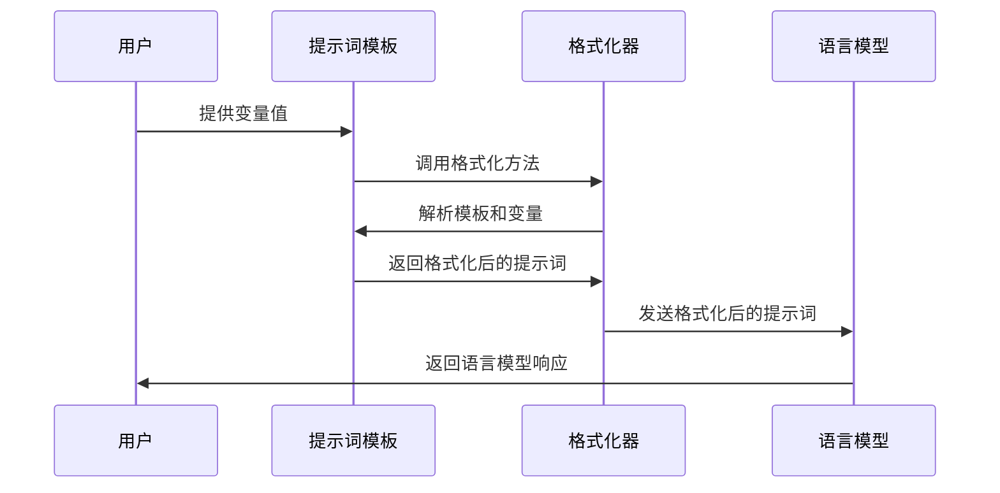
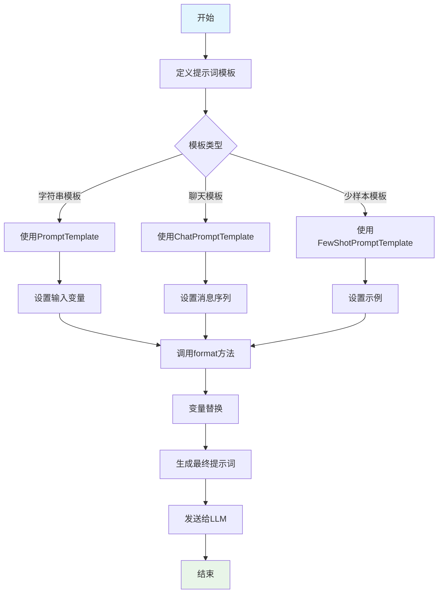

# LangChain提示词系统：全面解析与实践指南

## 目录
1. [提示词系统概述](#提示词系统概述)
2. [整体架构](#整体架构)
3. [技术原理 (What, Why, How)](#技术原理)
4. [提示词处理流程](#提示词处理流程)
5. [示例代码](#示例代码)
6. [最佳实践](#最佳实践)

## 提示词系统概述

LangChain提示词系统是LangChain框架中用于创建、管理和格式化输入到语言模型的文本的核心组件。它提供了一套灵活的模板系统，让开发者能够动态生成包含变量的提示词，以适应不同的应用场景。

### 核心组件：
- **BasePromptTemplate**: 所有提示词模板的基类，定义了模板的基本结构和接口
- **PromptTemplate**: 最常用的字符串提示词模板，用于创建包含变量的文本
- **ChatPromptTemplate**: 用于聊天模型的提示词模板，支持多轮对话消息
- **StringPromptTemplate**: 字符串提示词模板的基类
- **MessagePromptTemplate**: 消息提示词模板的基类
- **FewShotPromptTemplate**: 少样本提示词模板，支持在提示中包含示例

## 整体架构

### 架构图

```mermaid
classDiagram
    class BasePromptTemplate {
        <<abstract>>
        +input_variables: list[str]
        +partial_variables: dict[str, Any]
        +output_parser: BaseOutputParser
        +format(**kwargs) str
        +format_prompt(**kwargs) PromptValue
    }
    
    class StringPromptTemplate {
        <<abstract>>
        +format_prompt(**kwargs) PromptValue
        +format(**kwargs) str
    }
    
    class BaseMessagePromptTemplate {
        <<abstract>>
        +input_variables: list[str]
        +format_messages(**kwargs) list[BaseMessage]
    }
    
    class BaseChatPromptTemplate {
        <<abstract>>
        +format_messages(**kwargs) list[BaseMessage]
        +format_prompt(**kwargs) ChatPromptValue
    }
    
    class PromptTemplate {
        +template: str
        +template_format: str
        +from_template(template) PromptTemplate
        +format(**kwargs) str
    }
    
    class ChatPromptTemplate {
        +messages: list[MessageLike]
        +from_messages(messages) ChatPromptTemplate
        +from_template(template) ChatPromptTemplate
        +format_messages(**kwargs) list[BaseMessage]
    }
    
    class FewShotPromptTemplate {
        +examples: list[dict]
        +example_prompt: PromptTemplate
        +prefix: str
        +suffix: str
        +format(**kwargs) str
    }
    
    class MessagesPlaceholder {
        +variable_name: str
        +format_messages(**kwargs) list[BaseMessage]
    }
    
    class HumanMessagePromptTemplate {
        +format_messages(**kwargs) list[BaseMessage]
    }
    
    class AIMessagePromptTemplate {
        +format_messages(**kwargs) list[BaseMessage]
    }
    
    class SystemMessagePromptTemplate {
        +format_messages(**kwargs) list[BaseMessage]
    }
    
    BasePromptTemplate <|-- StringPromptTemplate
    BasePromptTemplate <|-- BaseMessagePromptTemplate
    BasePromptTemplate <|-- BaseChatPromptTemplate
    StringPromptTemplate <|-- PromptTemplate
    StringPromptTemplate <|-- FewShotPromptTemplate
    BaseMessagePromptTemplate <|-- HumanMessagePromptTemplate
    BaseMessagePromptTemplate <|-- AIMessagePromptTemplate
    BaseMessagePromptTemplate <|-- SystemMessagePromptTemplate
    BaseMessagePromptTemplate <|-- MessagesPlaceholder
    BaseChatPromptTemplate <|-- ChatPromptTemplate
```



### 提示词处理时序图



### 提示词处理流程图



## 技术原理

### What - 什么是LangChain提示词系统？

LangChain提示词系统是一个用于创建、管理和格式化输入到语言模型的文本模板系统。它允许开发者定义包含变量的模板，然后用实际值替换这些变量，生成最终的提示词。

### Why - 为什么需要提示词系统？

#### 1. 动态内容生成
语言模型需要特定格式的输入。提示词系统提供了一种灵活的方式来生成包含动态内容的提示词。

#### 2. 模板复用
通过定义模板，开发者可以复用相同的结构，只需要替换变量部分，提高开发效率。

#### 3. 复杂交互支持
现代AI应用需要复杂的提示词结构，如多轮对话、少样本示例等。提示词系统支持这些复杂场景。

#### 4. 类型安全
通过预定义的模板结构，减少提示词格式错误。

### How - 提示词系统是如何工作的？

#### 1. 模板定义与使用
```python
from langchain_core.prompts import PromptTemplate

# 创建提示词模板
template = "告诉我关于{topic}的三个有趣事实"
prompt_template = PromptTemplate.from_template(template)

# 格式化模板
formatted_prompt = prompt_template.format(topic="太阳系")
print(formatted_prompt)  # 输出: 告诉我关于太阳系的三个有趣事实
```

#### 2. 提示词处理流程
- 用户定义包含变量的模板字符串
- 系统解析模板，提取变量名
- 用户提供变量值
- 系统将变量值替换到模板中对应位置
- 生成最终的提示词字符串

#### 3. 模板格式支持
- **f-string格式**: `{variable_name}` - 默认格式
- **jinja2格式**: `{{ variable_name }}` - 支持更复杂的逻辑
- **mustache格式**: `{{variable_name}}` - 简单的变量替换

#### 4. 提示词值对象
系统使用`PromptValue`对象来表示不同类型的提示词：
- `StringPromptValue`: 字符串提示词值
- `ChatPromptValue`: 聊天提示词值，包含消息列表

## 提示词处理流程

### 1. 基本提示词模板

最基础的用法是创建一个包含变量的提示词模板：

```python
from langchain_core.prompts import PromptTemplate

# 创建提示词模板
template = PromptTemplate(
    input_variables=["adjective", "content"],
    template="请写一个{adjective}的{content}故事"
)

# 格式化提示词
formatted = template.format(adjective="有趣的", content="科幻")
print(formatted)  # 输出: 请写一个有趣的科幻故事
```

### 2. 聊天提示词模板

聊天模型需要特定的消息格式，使用ChatPromptTemplate可以创建符合要求的消息序列：

```python
from langchain_core.prompts import ChatPromptTemplate, HumanMessagePromptTemplate, SystemMessagePromptTemplate

# 创建聊天提示词模板
chat_template = ChatPromptTemplate.from_messages([
    SystemMessagePromptTemplate.from_template("你是一个{role}助手"),
    HumanMessagePromptTemplate.from_template("{query}")
])

# 格式化消息
messages = chat_template.format_messages(
    role="客服",
    query="我想查询订单状态"
)
```

### 3. 少样本提示词

在提示词中包含示例，帮助模型理解任务要求：

```python
from langchain_core.prompts import FewShotPromptTemplate, PromptTemplate

# 定义示例
examples = [
    {"input": "苹果", "output": "苹果是一种水果"},
    {"input": "汽车", "output": "汽车是一种交通工具"}
]

# 定义示例格式
example_prompt = PromptTemplate(
    input_variables=["input", "output"],
    template="输入: {input}\n输出: {output}"
)

# 创建少样本模板
few_shot_prompt = FewShotPromptTemplate(
    examples=examples,
    example_prompt=example_prompt,
    prefix="请按照以下示例的格式回答问题:",
    suffix="输入: {query}\n输出:",
    input_variables=["query"]
)

# 格式化提示词
result = few_shot_prompt.format(query="书")
print(result)
```

### 4. 消息占位符

使用MessagesPlaceholder可以动态插入消息列表：

```python
from langchain_core.prompts import ChatPromptTemplate, MessagesPlaceholder, SystemMessagePromptTemplate

# 创建包含占位符的聊天模板
chat_template = ChatPromptTemplate.from_messages([
    SystemMessagePromptTemplate.from_template("你是一个友好的助手"),
    MessagesPlaceholder(variable_name="history"),
    ("human", "{input}")
])

# 格式化消息
messages = chat_template.format_messages(
    history=[
        ("human", "你好"),
        ("ai", "你好！有什么可以帮助你的吗？")
    ],
    input="今天天气怎么样？"
)
```

### 5. 提示词值转换

提示词模板可以转换为不同的值类型：

```python
from langchain_core.prompts import PromptTemplate
from langchain_core.prompt_values import StringPromptValue, ChatPromptValue

# 创建模板
template = PromptTemplate.from_template("你好，{name}！")

# 转换为字符串提示词值
string_value = template.invoke({"name": "张三"})
print(type(string_value))  # StringPromptValue

# 转换为聊天提示词值
chat_template = ChatPromptTemplate.from_messages([
    ("human", "你好，{name}！")
])
chat_value = chat_template.invoke({"name": "李四"})
print(type(chat_value))  # ChatPromptValue
```

## 示例代码

### 基本提示词模板示例

```python
from langchain_core.prompts import PromptTemplate

def example_basic_prompt():
    """基本提示词模板示例"""
    print("=== 基本提示词模板示例 ===")
    
    # 创建提示词模板
    template = PromptTemplate(
        input_variables=["product", "feature"],
        template="请描述{product}的{feature}特点"
    )
    
    # 格式化提示词
    result = template.format(product="智能手机", feature="电池续航")
    print(f"生成的提示词: {result}")
    
    return result

# 运行示例
example_basic_prompt()
```

### 聊天提示词模板示例

```python
from langchain_core.prompts import ChatPromptTemplate, SystemMessagePromptTemplate, HumanMessagePromptTemplate, AIMessagePromptTemplate

def example_chat_prompt():
    """聊天提示词模板示例"""
    print("=== 聊天提示词模板示例 ===")
    
    # 创建聊天提示词模板
    chat_template = ChatPromptTemplate.from_messages([
        SystemMessagePromptTemplate.from_template("你是一个{role}助手"),
        HumanMessagePromptTemplate.from_template("{query}"),
        AIMessagePromptTemplate.from_template("{response}")
    ])
    
    # 格式化消息
    messages = chat_template.format_messages(
        role="技术支持",
        query="我的电脑无法开机",
        response="请检查电源线是否连接正常"
    )
    
    print("生成的消息序列:")
    for i, msg in enumerate(messages):
        print(f"  {i+1}. [{msg.type}] {msg.content}")
    
    return messages

# 运行示例
example_chat_prompt()
```

### 多变量提示词示例

```python
from langchain_core.prompts import PromptTemplate

def example_multi_variable_prompt():
    """多变量提示词示例"""
    print("=== 多变量提示词示例 ===")
    
    # 创建包含多个变量的模板
    template = PromptTemplate.from_template(
        "请为{company}公司撰写一份关于{product}产品的{length}字营销文案，重点突出{feature}特点"
    )
    
    # 格式化提示词
    result = template.format(
        company="科技先锋",
        product="智能手表",
        length="200",
        feature="健康监测"
    )
    
    print(f"生成的提示词: {result}")
    return result

# 运行示例
example_multi_variable_prompt()
```

### 少样本提示词示例

```python
from langchain_core.prompts import FewShotPromptTemplate, PromptTemplate

def example_few_shot_prompt():
    """少样本提示词示例"""
    print("=== 少样本提示词示例 ===")
    
    # 定义示例
    examples = [
        {
            "question": "北京的首都",
            "answer": "北京是中国的首都"
        },
        {
            "question": "长江的长度",
            "answer": "长江长约6300公里"
        }
    ]
    
    # 定义示例格式
    example_prompt = PromptTemplate(
        input_variables=["question", "answer"],
        template="问题: {question}\n答案: {answer}"
    )
    
    # 创建少样本模板
    few_shot_prompt = FewShotPromptTemplate(
        examples=examples,
        example_prompt=example_prompt,
        prefix="请按照以下示例的格式回答问题:",
        suffix="问题: {input}\n答案:",
        input_variables=["input"]
    )
    
    # 格式化提示词
    result = few_shot_prompt.format(input="上海的人口")
    print(f"生成的提示词:\n{result}")
    
    return result

# 运行示例
example_few_shot_prompt()
```

### 消息占位符示例

```python
from langchain_core.prompts import ChatPromptTemplate, MessagesPlaceholder, SystemMessagePromptTemplate, HumanMessagePromptTemplate

def example_messages_placeholder():
    """消息占位符示例"""
    print("=== 消息占位符示例 ===")
    
    # 创建包含消息占位符的聊天模板
    chat_template = ChatPromptTemplate.from_messages([
        SystemMessagePromptTemplate.from_template("你是一个{role}助手"),
        MessagesPlaceholder(variable_name="history"),
        HumanMessagePromptTemplate.from_template("{input}")
    ])
    
    # 格式化消息
    messages = chat_template.format_messages(
        role="客服",
        history=[
            ("human", "你好"),
            ("ai", "你好！有什么可以帮助你的吗？"),
            ("human", "我想查询订单"),
            ("ai", "请提供您的订单号")
        ],
        input="订单号是123456"
    )
    
    print("生成的消息序列:")
    for i, msg in enumerate(messages):
        print(f"  {i+1}. [{msg.type}] {msg.content}")
    
    return messages

# 运行示例
example_messages_placeholder()
```

### 完整的提示词应用示例

```python
from langchain_core.prompts import ChatPromptTemplate, SystemMessagePromptTemplate, HumanMessagePromptTemplate, MessagesPlaceholder
from langchain_core.messages import HumanMessage, AIMessage

def example_complete_prompt_application():
    """完整的提示词应用示例"""
    print("=== 完整的提示词应用示例 ===")
    
    # 创建一个客服对话的聊天模板
    customer_service_template = ChatPromptTemplate.from_messages([
        SystemMessagePromptTemplate.from_template(
            "你是一个专业的{company}客服助手。请使用友好、专业的语气回答客户问题。"
        ),
        MessagesPlaceholder(variable_name="history"),
        HumanMessagePromptTemplate.from_template("{customer_query}")
    ])
    
    # 模拟对话历史
    conversation_history = [
        HumanMessage(content="你好"),
        AIMessage(content="您好！欢迎联系我们的客服。有什么可以帮助您的吗？"),
        HumanMessage(content="我想查询我的订单状态")
    ]
    
    # 当前用户查询
    current_query = "订单号是ORD-2023-001，请问现在什么状态？"
    
    # 格式化完整的消息序列
    full_messages = customer_service_template.format_messages(
        company="科技商城",
        history=conversation_history,
        customer_query=current_query
    )
    
    print("完整的对话消息序列:")
    for i, msg in enumerate(full_messages):
        print(f"  {i+1}. [{msg.type}] {msg.content}")
    
    return full_messages

# 运行示例
example_complete_prompt_application()
```

### 模板部分变量示例

```python
from langchain_core.prompts import PromptTemplate

def example_partial_variables():
    """部分变量示例"""
    print("=== 部分变量示例 ===")
    
    # 创建一个包含多个变量的模板
    template = PromptTemplate.from_template(
        "{greeting}，我是{user}，我想了解{product}的{feature}功能"
    )
    
    # 部分填充变量
    partial_template = template.partial(greeting="您好", user="张三")
    
    # 完成剩余变量的填充
    result1 = partial_template.format(product="智能手机", feature="拍照")
    result2 = partial_template.format(product="笔记本电脑", feature="性能")
    
    print(f"结果1: {result1}")
    print(f"结果2: {result2}")
    
    return [result1, result2]

# 运行示例
example_partial_variables()
```

## 最佳实践

### 模板设计策略

1. **清晰的变量命名**: 使用有意义的变量名，便于理解和维护
2. **模板验证**: 在使用前验证模板的正确性
3. **错误处理**: 处理变量缺失或格式错误的情况

### 性能优化

1. **缓存模板**: 对于重复使用的模板，可以缓存以提高性能
2. **预编译模板**: 对于复杂模板，可以预编译以减少运行时开销
3. **合理使用部分变量**: 通过部分变量减少重复代码

### 安全注意事项

1. **输入验证**: 验证用户输入，防止注入攻击
2. **模板格式**: 优先使用安全的f-string格式，谨慎使用jinja2格式
3. **内容过滤**: 对生成的提示词内容进行适当过滤

### 模板复用

```python
from langchain_core.prompts import ChatPromptTemplate, SystemMessagePromptTemplate, HumanMessagePromptTemplate

def create_reusable_templates():
    """创建可重用的模板"""
    
    # 通用客服模板
    customer_service_template = ChatPromptTemplate.from_messages([
        SystemMessagePromptTemplate.from_template(
            "你是{company}的客服助手，专业、友好地回答客户问题"
        ),
        ("human", "{query}")
    ])
    
    # 产品介绍模板
    product_info_template = ChatPromptTemplate.from_messages([
        SystemMessagePromptTemplate.from_template(
            "请基于以下产品信息回答用户问题：{product_info}"
        ),
        ("human", "{query}")
    ])
    
    return {
        "customer_service": customer_service_template,
        "product_info": product_info_template
    }

# 创建模板集合
templates = create_reusable_templates()
print("可重用模板创建完成")
```

## 总结

LangChain的提示词系统是一个强大而灵活的工具，它通过标准化的模板系统，让开发者能够轻松创建和管理动态提示词。无论你是构建简单的问答系统，还是复杂的多轮对话应用，提示词系统都能提供必要的支持。

理解提示词系统的关键在于：
- 掌握不同模板类型的作用
- 学会创建和管理模板变量
- 了解高级功能如部分变量和消息占位符
- 在实际应用中灵活运用

通过本文的学习，你应该已经掌握了LangChain提示词系统的核心概念和使用方法，可以开始构建自己的AI应用了。