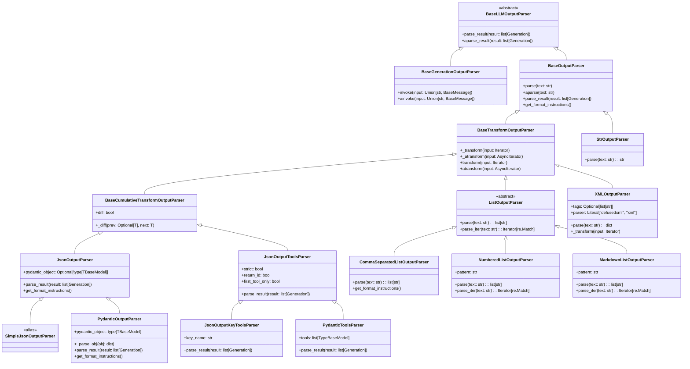

# LangChain输出解析器完全指南

## 目录
1. [概述](#概述)
2. [技术模块详解](#技术模块详解)
3. [架构图解](#架构图解)
4. [技术原理](#技术原理)
5. [示例代码](#示例代码)
6. [使用场景](#使用场景)
7. [最佳实践](#最佳实践)

## 概述

### What - 什么是输出解析器(Output Parser)

输出解析器(Output Parser)是LangChain框架中的一种工具，用于将语言模型(LLM)的原始输出转换为结构化的、可预测的数据格式。你可以把它想象成一个"翻译官"，负责将AI模型产生的自由格式文本"翻译"成程序可以直接处理的结构化数据。

简单来说，当你向语言模型提问并得到回答后，输出解析器会进一步处理这个回答，确保它符合你期望的格式，比如JSON对象、Pydantic模型、列表或XML等。

### Why - 为什么需要输出解析器

想象一下，如果你直接使用语言模型的原始输出，会面临以下问题：

1. **格式不一致**：AI的回答可能每次格式都不同，有时是JSON，有时是普通文本
2. **类型不安全**：无法保证AI输出的数据类型符合你的应用需求
3. **难以处理**：原始输出需要额外的解析逻辑，增加了代码复杂性
4. **错误处理困难**：当AI输出不符合预期时，很难优雅地处理错误

输出解析器解决了这些问题，它确保了：
- 输出格式的一致性
- 类型安全
- 错误处理的标准化
- 代码的可维护性

### How - 输出解析器是如何工作的

输出解析器的工作原理可以分为三个步骤：

#### 1. 接收原始输出
输出解析器接收来自语言模型的原始输出，这可以是字符串、消息对象或生成结果。

#### 2. 应用解析逻辑
根据解析器的类型，应用相应的解析逻辑：
- **字符串解析器**：直接返回原始字符串
- **JSON解析器**：解析JSON格式并验证结构
- **Pydantic解析器**：将JSON解析为指定的Pydantic模型
- **列表解析器**：将文本解析为列表项
- **XML解析器**：解析XML结构

#### 3. 返回结构化数据
返回经过验证和格式化的结构化数据，或者在解析失败时抛出异常。

## 技术模块详解

### 1. 基础解析器

- **StrOutputParser**: 最简单的解析器，直接返回原始字符串，适用于不需要格式化的场景
- **BaseOutputParser**: 抽象基类，定义了所有输出解析器的通用接口

### 2. JSON解析器

- **JsonOutputParser**: 将AI输出解析为JSON对象，适用于需要结构化数据的场景
- **SimpleJsonOutputParser**: 与JsonOutputParser相同，是后者的别名

### 3. Pydantic解析器

- **PydanticOutputParser**: 将JSON输出解析为Pydantic模型实例，提供类型安全和数据验证

### 4. 列表解析器

- **CommaSeparatedListOutputParser**: 解析逗号分隔的列表
- **NumberedListOutputParser**: 解析编号列表
- **MarkdownListOutputParser**: 解析Markdown格式的列表
- **ListOutputParser**: 列表解析器的抽象基类

### 5. XML解析器

- **XMLOutputParser**: 解析XML格式的输出，支持安全的XML解析

### 6. 工具解析器

- **JsonOutputToolsParser**: 解析OpenAI工具调用格式的输出
- **JsonOutputKeyToolsParser**: 解析特定类型的工具调用
- **PydanticToolsParser**: 将工具调用解析为Pydantic对象

## 架构图解

### 类继承关系图



### 架构流程图


### 时序图


## 技术原理

### 1. 核心概念
输出解析器(Output Parser)是LangChain框架中的关键组件，负责将语言模型(LLM)的原始输出转换为结构化、可预测的数据格式。它充当了非结构化AI输出和结构化应用数据之间的桥梁。

### 2. 设计模式
- **抽象基类设计**: 使用`BaseOutputParser`作为所有解析器的基类，定义了统一的接口
- **泛型支持**: 使用TypeVar `T` 支持不同类型的数据输出
- **可扩展性**: 通过继承体系支持多种解析器类型
- **流式处理**: 通过`BaseTransformOutputParser`支持流式数据处理

### 3. 继承体系
- `BaseLLMOutputParser`: 抽象基类，定义了核心解析接口
- `BaseOutputParser`: 实现了基本解析逻辑，包含同步和异步方法
- `BaseTransformOutputParser`: 支持流式处理的解析器基类
- `BaseCumulativeTransformOutputParser`: 支持增量解析的基类

### 4. 关键特性
- **同步/异步支持**: 所有解析器都提供同步和异步版本
- **流式解析**: 支持对流式输入进行实时解析
- **格式验证**: 内置格式验证和错误处理机制
- **格式指令**: 提供标准化的格式说明生成

### 5. 解析器类型详解

#### StrOutputParser
最简单的解析器，直接返回原始字符串，不进行任何处理。

#### JsonOutputParser
解析JSON格式输出，支持部分JSON解析和格式验证，可与Pydantic模型结合使用。

#### PydanticOutputParser
基于Pydantic模型的强类型解析器，将JSON输出解析为指定的Pydantic对象，提供类型安全和验证。

#### ListOutputParser
抽象基类，用于解析列表格式输出，有多种具体实现：
- `CommaSeparatedListOutputParser`: 解析逗号分隔列表
- `NumberedListOutputParser`: 解析编号列表
- `MarkdownListOutputParser`: 解析Markdown列表

#### XMLOutputParser
解析XML格式输出，支持安全的XML解析（使用defusedxml防止XML漏洞）。

#### OpenAI Tools Parsers
- `JsonOutputToolsParser`: 解析OpenAI工具调用格式
- `JsonOutputKeyToolsParser`: 解析特定类型的工具调用
- `PydanticToolsParser`: 将工具调用解析为Pydantic对象

### 6. 核心工作流程
1. LLM生成原始输出
2. 输出解析器接收原始输出
3. 根据解析器类型进行格式转换
4. 返回结构化数据或抛出异常

### 7. 错误处理
- 使用`OutputParserException`处理解析错误
- 提供详细的错误信息帮助调试
- 支持部分解析模式处理不完整输出

## 示例代码

```python
# 示例1: 基础字符串输出解析器
from langchain_core.output_parsers import StrOutputParser

# StrOutputParser直接返回原始字符串
parser = StrOutputParser()
result = parser.parse("Hello, World!")
print(f"字符串解析器结果: {result}")

# 示例2: JSON输出解析器
from langchain_core.output_parsers import JsonOutputParser
import json

# JsonOutputParser将字符串解析为JSON对象
json_parser = JsonOutputParser()
json_string = '{"name": "张三", "age": 30, "city": "北京"}'
json_result = json_parser.parse(json_string)
print(f"JSON解析器结果: {json_result}")

# 获取格式指令
format_instructions = json_parser.get_format_instructions()
print(f"JSON格式指令: {format_instructions}")

# 示例3: Pydantic输出解析器
from langchain_core.output_parsers import PydanticOutputParser
from pydantic import BaseModel, Field
from typing import List

# 定义Pydantic模型
class Person(BaseModel):
    name: str = Field(description="姓名")
    age: int = Field(description="年龄", ge=0, le=150)
    skills: List[str] = Field(description="技能列表")

# 使用PydanticOutputParser解析为模型对象
pydantic_parser = PydanticOutputParser(pydantic_object=Person)
person_json = '{"name": "李四", "age": 25, "skills": ["Python", "机器学习", "数据分析"]}'
person_result = pydantic_parser.parse(person_json)
print(f"Pydantic解析器结果: {person_result}")
print(f"姓名: {person_result.name}, 年龄: {person_result.age}, 技能: {person_result.skills}")

# 获取Pydantic格式指令
pydantic_format_instructions = pydantic_parser.get_format_instructions()
print(f"Pydantic格式指令: {pydantic_format_instructions}")

# 示例4: 列表输出解析器
from langchain_core.output_parsers import CommaSeparatedListOutputParser

# 逗号分隔列表解析器
list_parser = CommaSeparatedListOutputParser()
list_string = "苹果, 香蕉, 橙子, 葡萄"
list_result = list_parser.parse(list_string)
print(f"列表解析器结果: {list_result}")

# 获取列表格式指令
list_format_instructions = list_parser.get_format_instructions()
print(f"列表格式指令: {list_format_instructions}")

# 示例5: 编号列表解析器
from langchain_core.output_parsers import NumberedListOutputParser

numbered_parser = NumberedListOutputParser()
numbered_text = "1. 第一步\n2. 第二步\n3. 第三步"
numbered_result = numbered_parser.parse(numbered_text)
print(f"编号列表解析器结果: {numbered_result}")

# 示例6: Markdown列表解析器
from langchain_core.output_parsers import MarkdownListOutputParser

markdown_parser = MarkdownListOutputParser()
markdown_text = "- 项目一\n- 项目二\n- 项目三"
markdown_result = markdown_parser.parse(markdown_text)
print(f"Markdown列表解析器结果: {markdown_result}")

# 示例7: XML输出解析器
from langchain_core.output_parsers import XMLOutputParser

xml_parser = XMLOutputParser(tags=["person", "name", "age"])
xml_text = "<person><name>王五</name><age>28</age></person>"
xml_result = xml_parser.parse(xml_text)
print(f"XML解析器结果: {xml_result}")

# 示例8: OpenAI工具解析器
from langchain_core.output_parsers import JsonOutputToolsParser

tools_parser = JsonOutputToolsParser()
# 模拟OpenAI工具调用的输出
tools_json = '[{"function": {"name": "get_current_weather", "arguments": "{\\"location\\": \\"北京\\", \\"format\\": \\"celsius\\"}"}}]'
try:
    tools_result = tools_parser.parse(tools_json)
    print(f"工具解析器结果: {tools_result}")
except:
    print("工具解析器示例需要特定格式的输入")

# 示例9: 流式解析示例
from langchain_core.output_parsers import JsonOutputParser
from langchain_core.prompts import ChatPromptTemplate
from langchain_core.messages import HumanMessage

# 演示流式解析功能
streaming_parser = JsonOutputParser()
# 模拟流式输入
streaming_data = ["{", '"name": "流式解析"', ", ", '"value": 123', "}"]
accumulated = ""
for chunk in streaming_data:
    accumulated += chunk
    try:
        # 尝试解析累积的文本
        result = streaming_parser.parse(accumulated)
        print(f"流式解析结果: {result}")
    except:
        print(f"部分数据，继续累积: {accumulated}")
```

## 使用场景

### 1. 数据提取
当需要从AI生成的文本中提取结构化数据时，如从简历中提取姓名、电话、邮箱等信息。

### 2. API响应格式化
将AI生成的内容格式化为API可以处理的结构化数据格式。

### 3. 表单验证
使用Pydantic解析器可以自动验证AI输出是否符合预定义的数据结构要求。

### 4. 工具调用
在AI代理系统中，解析AI生成的工具调用请求。

### 5. 内容分类
将AI生成的内容解析为分类标签或关键词列表。

## 最佳实践

### 1. 选择合适的解析器
- 对于简单输出，使用`StrOutputParser`
- 对于结构化数据，使用`JsonOutputParser`
- 对于强类型验证，使用`PydanticOutputParser`
- 对于列表数据，使用相应的列表解析器

### 2. 提供格式指令
在提示词中包含解析器的格式指令，帮助AI生成符合要求的输出：

```python
from langchain_core.output_parsers import JsonOutputParser

parser = JsonOutputParser()
format_instructions = parser.get_format_instructions()
prompt = f"请回答以下问题，并按照以下JSON格式返回结果：{format_instructions}"
```

### 3. 错误处理
始终准备好处理解析错误，提供有意义的错误信息：

```python
try:
    result = parser.parse(llm_output)
except OutputParserException as e:
    print(f"解析失败: {e}")
    # 处理错误或重新请求
```

### 4. 性能考虑
- 对于大量数据，考虑使用流式解析器
- 避免过度复杂的嵌套结构，这会增加解析失败的风险
- 在生产环境中，对解析器进行适当的单元测试

### 5. 安全性
- 使用`XMLOutputParser`时，确保使用安全的解析器（defusedxml）
- 验证解析结果的完整性，防止注入攻击
- 限制解析器的资源使用，防止恶意输入导致的资源耗尽
