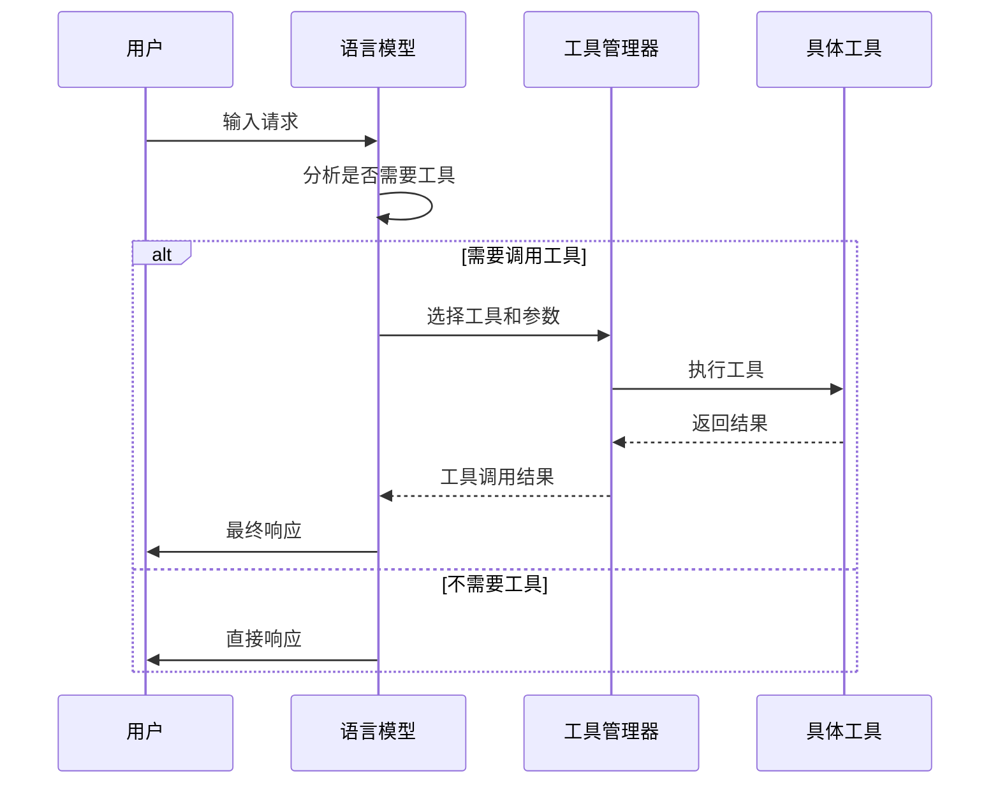
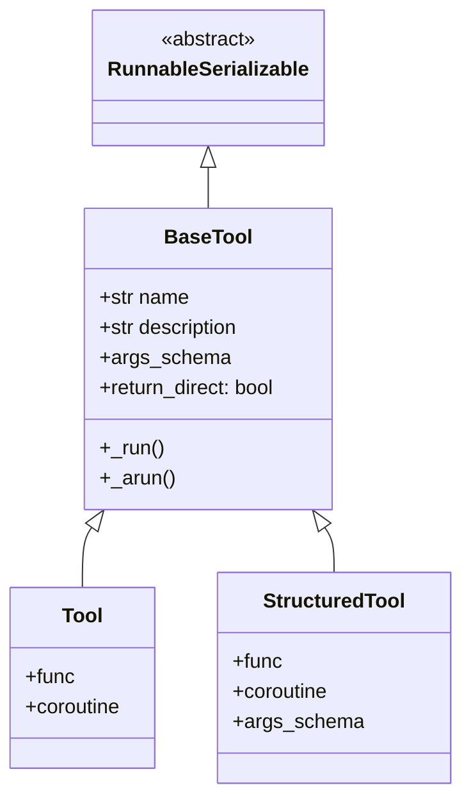
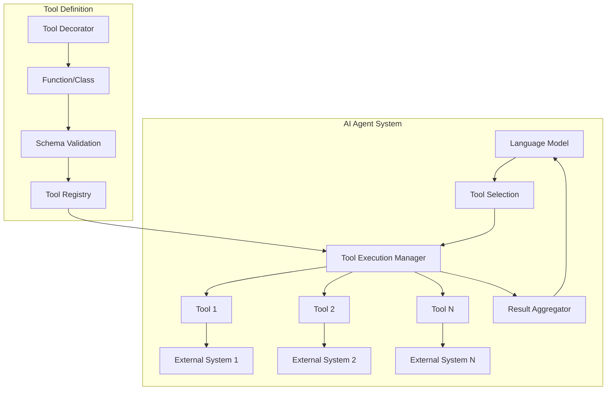

# LangChain工具详解：从入门到精通

## 什么是LangChain工具（What）

LangChain工具本质上是为AI智能体（Agent）提供扩展能力的接口。你可以把它们想象成智能体的"超能力"扩展包，让AI不仅限于文本生成，还能执行具体任务。

在LangChain中，工具是类的实例，这些类实现了特定的接口，使得语言模型能够理解何时以及如何使用它们。每个工具都有一个清晰的描述，AI通过这个描述来判断在特定情况下应该使用哪个工具。

### 核心概念
- **工具（Tool）**：执行特定功能的函数或类
- **工具调用（Tool Call）**：AI决定使用某个工具及其参数
- **工具执行（Tool Execution）**：实际运行工具并返回结果
- **工具集（ToolKit）**：相关工具的集合

## 为什么需要LangChain工具（Why）

### 1. 扩展AI能力边界
语言模型虽然强大，但存在以下局限：
- **知识截止时间**：模型的训练数据有时间限制
- **缺乏实时信息**：无法获取当前的实时数据
- **无法执行操作**：只能生成文本，不能执行实际任务

工具恰好解决了这些问题，让AI能够：
- 访问实时信息（如天气、股价）
- 执行计算和数据处理
- 与外部系统交互（如数据库、API）
- 执行多步骤任务

### 2. 构建更智能的AI系统
通过工具，我们可以构建能够：
- 自主决策使用哪个工具
- 串联多个工具完成复杂任务
- 基于工具结果做出进一步判断的AI系统

## 如何使用LangChain工具（How）

### 1. 工具类型详解

#### 简单工具（Simple Tool）
使用`@tool`装饰器创建最简单的工具：

```python
from langchain_core.tools import tool

@tool
def multiply(a: int, b: int) -> int:
    """Multiply two numbers."""
    return a * b

# 查看工具属性
print(multiply.name)        # multiply
print(multiply.description) # Multiply two numbers.
print(multiply.args)        # {'a': {'type': 'integer'}, 'b': {'type': 'integer'}}
```

#### 结构化工具（Structured Tool）
当需要更复杂的输入验证时，使用结构化工具：

```python
from langchain_core.tools import StructuredTool
from pydantic import BaseModel, Field

class CalculatorInput(BaseModel):
    """Inputs for calculator."""
    a: int = Field(description="First number")
    b: int = Field(description="Second number")

def calculator_func(a: int, b: int) -> int:
    """Calculator function."""
    return a + b

calculator = StructuredTool.from_function(
    func=calculator_func,
    name="Calculator",
    description="Useful for when you need to add numbers",
    args_schema=CalculatorInput
)
```

#### 异步工具
对于耗时操作，可以创建异步工具：

```python
from langchain_core.tools import tool

@tool
async def async_multiply(a: int, b: int) -> int:
    """Multiply two numbers asynchronously."""
    import asyncio
    await asyncio.sleep(0.1)  # 模拟异步操作
    return a * b
```

### 2. 工具架构与实现原理

#### 基础工具类层次结构
```
RunnableSerializable --> BaseTool --> SimpleTool/StructuredTool
```

#### BaseTool核心属性
- `name`：工具的唯一标识名
- `description`：描述工具用途的文本
- `args_schema`：输入参数的验证模式
- `return_direct`：是否直接返回结果
- `response_format`：返回格式设置

### 3. 实际应用示例

#### 创建自定义工具集
```python
from langchain_core.tools import BaseTool
from typing import Optional
import requests

class WeatherTool(BaseTool):
    name = "get_weather"
    description = "Get current weather information for a city"

    def _run(self, city: str) -> str:
        # 这里可以调用真实的天气API
        return f"Current weather in {city} is sunny, 25°C"
    
    async def _arun(self, city: str):
        # 异步版本
        return await self._run(city)

weather_tool = WeatherTool()
```

#### 使用工具与模型结合
```python
from langchain_openai import ChatOpenAI
from langchain_core.messages import HumanMessage

# 创建模型实例
llm = ChatOpenAI(model="gpt-3.5-turbo")

# 绑定工具到模型
llm_with_tools = llm.bind_tools([multiply, weather_tool])

# 调用模型
messages = [HumanMessage(content="What's 23 times 45?")]
response = llm_with_tools.invoke(messages)

# 检查是否有工具调用
if response.tool_calls:
    print("模型决定调用工具:")
    for tool_call in response.tool_calls:
        print(f"工具名: {tool_call['name']}")
        print(f"参数: {tool_call['args']}")
```

### 4. 高级功能

#### 工具回调与追踪
工具支持回调机制，可以追踪执行过程：

```python
from langchain_core.callbacks import CallbackManager

def on_tool_start(name, input_str):
    print(f"开始执行工具: {name}, 输入: {input_str}")

def on_tool_end(output, name):
    print(f"工具 {name} 执行完成, 输出: {output}")

# 使用回调
result = multiply.invoke(
    {"a": 5, "b": 6},
    callbacks=[on_tool_start, on_tool_end]
)
```

#### 工具错误处理
```python
from langchain_core.tools import ToolException

@tool
def risky_operation(x: int) -> int:
    """A tool that might fail."""
    if x < 0:
        raise ToolException("Input cannot be negative")
    return x * 2

# 配置错误处理
risky_tool = risky_operation
risky_tool.handle_tool_error = True  # 自动处理错误
```

### 5. 工具渲染与展示

LangChain提供了工具渲染功能，用于向语言模型展示可用工具：

```python
from langchain_core.tools import render_text_description

tools = [multiply, weather_tool]
tool_descriptions = render_text_description(tools)
print(tool_descriptions)

# 输出格式为:
# multiply(a: int, b: int) - Multiply two numbers.
# get_weather(city: str) - Get current weather information for a city
```

## 技术架构图

### 工具执行流程


### 工具类继承关系


### 系统架构图

## 5. 源码设计思想分析

### 5.1 核心设计思想

**可组合性（Composability）**
- 工具系统基于Runnable设计，天然支持与其他组件组合
- 通过继承RunnableSerializable，工具具备完整的执行生命周期
- 支持管道操作（|）和其他LCEL组合操作

**统一抽象（Unified Abstraction）**
- BaseTool作为所有工具的基类，提供统一的接口
- 无论是简单函数还是复杂类，都可以作为工具使用
- 同步和异步执行通过_run和_arun方法统一处理

**类型安全（Type Safety）**
- 利用Pydantic进行参数验证和类型检查
- 通过类型注解自动推断参数结构
- 提供运行时和编译时的双重保障

### 5.2 关键实现分析

**BaseTool类设计**
```python
class BaseTool(RunnableSerializable[Union[str, dict, ToolCall], Any])
```
- 继承RunnableSerializable，获得完整的执行能力
- 泛型参数支持多种输入类型（字符串、字典、ToolCall）
- 实现了invoke/ainvoke方法，支持同步异步调用

**输入处理机制**
- 智能解析不同格式的输入
- 支持字符串输入（简单工具）和字典输入（结构化工具）
- 处理注入参数（如InjectedToolCallId）

**执行生命周期管理**
- 使用回调管理器追踪执行过程
- 提供on_tool_start、on_tool_end等钩子
- 支持详细的执行日志和监控

### 5.3 设计模式应用

- **模板方法模式**：BaseTool定义执行流程，子类实现具体逻辑
- **工厂模式**：@tool装饰器作为工具创建的工厂
- **策略模式**：支持不同的参数验证和错误处理策略

## 总结

LangChain工具是构建智能AI应用的关键组件，它们为语言模型提供了扩展能力，使其能够执行具体任务并与外部系统交互。通过合理设计和使用工具，我们可以构建功能强大、智能的AI系统，解决复杂问题。

掌握工具的创建、管理和使用方法，是成为LangChain高级用户的重要一步。随着实践的深入，你会发现工具系统为AI应用带来的无限可能性。