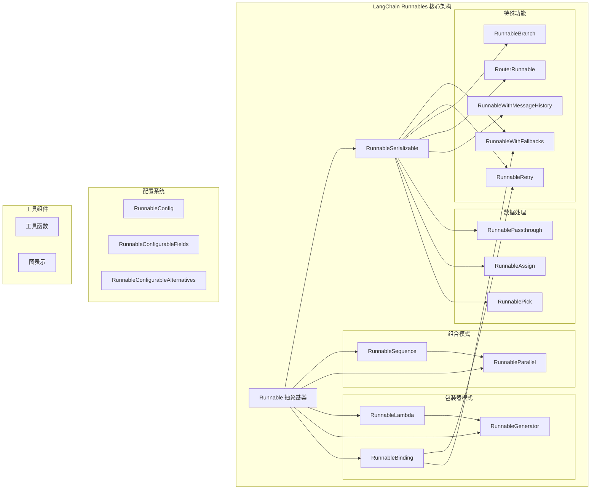
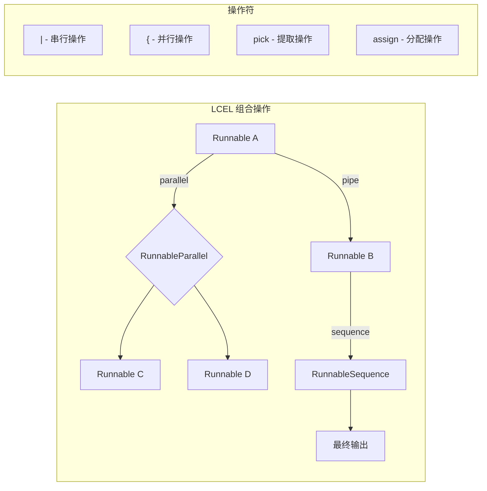

# LangChain Runnables 完全指南

## 目录
1. [什么是Runnables？](#什么是runnables)
2. [为什么需要Runnables？](#为什么需要runnables)
3. [Runnables如何工作？](#runnables如何工作)
4. [核心技术模块](#核心技术模块)
5. [架构设计](#架构设计)
6. [设计思想与核心实现](#设计思想与核心实现)
7. [实际应用示例](#实际应用示例)
8. [总结](#总结)

## 什么是Runnables？

LangChain Runnables是LangChain框架中的核心抽象接口，它定义了一个可执行单元的标准，允许开发者以统一的方式创建、组合和执行各种AI应用组件（如提示词、语言模型、解析器、工具等）。Runnables提供了一套标准接口，让不同类型的组件可以无缝地连接在一起形成可执行链。

Runnables的核心是一个抽象基类`Runnable`，它定义了所有可执行组件必须实现的接口：

- `invoke()` - 同步执行单个输入
- `ainvoke()` - 异步执行单个输入
- `batch()` - 批量处理多个输入
- `abatch()` - 异步批量处理
- `stream()` - 流式处理输出
- `astream()` - 异步流式处理
- `transform()` - 流式转换输入
- `astream_events()` - 流式输出事件

## 为什么需要Runnables？

### 1. **统一接口**
在Runnables出现之前，不同的AI组件（如提示词模板、语言模型、输出解析器等）都有自己独特的调用方式。Runnables提供了一个统一的接口，使得所有组件都可以用相同的方式调用，大大简化了组件的使用和组合。

### 2. **组合性**
Runnables支持通过管道操作符（`|`）进行组合，形成可执行链。这种组合方式是声明式的，开发者只需定义数据流，框架会自动处理执行逻辑。

### 3. **多模式支持**
Runnables天然支持同步、异步、批量和流式处理，开发者无需为不同的执行模式编写不同的代码。

### 4. **可观测性**
Runnables内置了回调系统，可以轻松追踪执行过程、性能指标和错误信息，便于调试和监控。

### 5. **可配置性**
Runnables支持运行时配置，允许在不修改代码的情况下调整组件行为。

## Runnables如何工作？

### 1. **基本执行流程**
```python
# 每个Runnable都遵循相同的执行模式
output = runnable.invoke(input, config)
```

执行流程包括：
- 配置处理（`ensure_config`）
- 回调管理器初始化
- 执行核心逻辑
- 结果处理
- 回调完成

### 2. **组合模式**
- **序列组合**：使用`|`操作符或`RunnableSequence`，前一个组件的输出作为后一个组件的输入
- **并行组合**：使用`RunnableParallel`或字典，相同输入并行执行多个组件

### 3. **异步支持**
Runnables提供了完整的异步支持，使用`asyncio`和线程池来处理阻塞操作，确保高性能。

### 4. **流式处理**
通过`stream`/`astream`方法，Runnables可以实现流式处理，这对于需要实时响应的应用非常重要。

### 5. **错误处理**
Runnables内置了重试机制（`RunnableRetry`）和降级机制（`RunnableWithFallbacks`），提高应用的健壮性。

## 核心技术模块

### 核心模块
1. **runnables/base.py** - Runnable基类和核心实现
   - `Runnable` - 抽象基类
   - `RunnableSerializable` - 可序列化Runnable
   - `RunnableSequence` - 串行执行的Runnable序列
   - `RunnableParallel` - 并行执行的Runnable映射
   - `RunnableLambda` - 将函数包装为Runnable
   - `RunnableGenerator` - 生成器Runnable
   - `RunnableEach` - 对序列中每个元素执行Runnable
   - `RunnableBinding` - 为Runnable添加功能的装饰器

### 配置与工具模块
2. **runnables/config.py** - 配置管理
   - `RunnableConfig` - 配置类型定义
   - 配置合并、补丁、上下文管理等功能

3. **runnables/utils.py** - 工具函数
   - `ConfigurableField` - 可配置字段
   - `AddableDict` - 可相加字典
   - 异步并发工具函数

### 特殊功能模块
4. **runnables/passthrough.py** - 透传和数据操作
   - `RunnablePassthrough` - 透传输入
   - `RunnableAssign` - 为字典输入分配键值对
   - `RunnablePick` - 从字典输入中提取键

5. **runnables/fallbacks.py** - 降级处理
   - `RunnableWithFallbacks` - 带降级的Runnable

6. **runnables/retry.py** - 重试机制
   - `RunnableRetry` - 带重试的Runnable

7. **runnables/branch.py** - 分支逻辑
   - `RunnableBranch` - 条件分支Runnable

8. **runnables/router.py** - 路由功能
   - `RouterRunnable` - 基于键值路由的Runnable

### 配置化模块
9. **runnables/configurable.py** - 动态配置
   - `RunnableConfigurableFields` - 可配置字段
   - `RunnableConfigurableAlternatives` - 可配置替代方案

### 历史记录模块
10. **runnables/history.py** - 消息历史管理
    - `RunnableWithMessageHistory` - 带消息历史的Runnable

### 图形化模块
1. **runnables/graph.py** - 图形表示
    - `Graph` - 图形结构
    - `Node`/`Edge` - 节点和边

12. **runnables/graph_mermaid.py** - Mermaid图表
    - 生成Mermaid语法图表

13. **runnables/graph_png.py** - PNG图表
    - 生成PNG格式图表

14. **runnables/graph_ascii.py** - ASCII图表
    - 生成ASCII艺术图表

## 架构设计



### 执行流程图

```mermaid
graph TD
    subgraph "核心执行流程"
        A[用户输入] --> B[Runnable.invoke/ainvoke]
        B --> C[配置处理 ensure_config]
        C --> D[回调管理器初始化]
        D --> E[执行具体逻辑]
        E --> F[处理输出]
        F --> G[回调完成]
        G --> H[返回结果]
    end
    
    subgraph "批处理流程"
        I[批量输入] --> J[Runnable.batch/abatch]
        J --> K[配置列表处理]
        K --> L[并行执行]
        L --> M[结果聚合]
        M --> N[返回批量结果]
    end
    
    subgraph "流处理流程"
        O[流输入] --> P[Runnable.stream/astream]
        P --> Q[转换处理 transform/atransform]
        Q --> R[逐块处理]
        R --> S[逐块输出]
    end
```


### LCEL组合操作


## 设计思想与核心实现

### 1. **单一职责原则**
每个Runnable只负责一个特定的功能，这使得组件易于理解、测试和维护。

### 2. **开闭原则**
通过组合模式，Runnables可以扩展新功能而无需修改现有代码，满足开闭原则。

### 3. **接口隔离原则**
Runnable定义了最小但完整的接口，避免了不必要的依赖。

### 4. **依赖注入**
通过配置系统和依赖注入，Runnables可以灵活地接收外部依赖，提高了可测试性。

### 5. **异步优先设计**
Runnables从设计之初就考虑了异步支持，确保在高并发场景下的性能。

### 核心实现细节

#### Runnable抽象基类
```python
class Runnable(ABC, Generic[Input, Output]):
    """A unit of work that can be invoked, batched, streamed, transformed and composed."""
    
    @abstractmethod
    def invoke(
        self,
        input: Input,
        config: Optional[RunnableConfig] = None,
        **kwargs: Any,
    ) -> Output:
        """Transform a single input into an output."""
    
    async def ainvoke(
        self,
        input: Input,
        config: Optional[RunnableConfig] = None,
        **kwargs: Any,
    ) -> Output:
        """Default implementation of ainvoke, calls invoke from a thread."""
    
    def batch(
        self,
        inputs: list[Input],
        config: Optional[Union[RunnableConfig, list[RunnableConfig]]] = None,
        *,
        return_exceptions: bool = False,
        **kwargs: Optional[Any],
    ) -> list[Output]:
        """Default implementation runs invoke in parallel using a thread pool executor."""
    
    # 其他方法...
```

#### 组合模式实现
Runnables通过`|`操作符实现链式组合，其核心是`RunnableSequence`类：

```python
def __or__(
    self,
    other: Union[
        Runnable[Any, Other],
        Callable[[Iterator[Any]], Iterator[Other]],
        Callable[[AsyncIterator[Any]], AsyncIterator[Other]],
        Callable[[Any], Other],
        Mapping[str, Union[Runnable[Any, Other], Callable[[Any], Other], Any]],
    ],
) -> RunnableSerializable[Input, Other]:
    """Compose this Runnable with another object to create a RunnableSequence."""
    return RunnableSequence(self, coerce_to_runnable(other))
```

#### 配置系统
Runnables的配置系统通过`RunnableConfig`类型定义实现，支持标签、元数据、回调等配置项：

```python
class RunnableConfig(TypedDict, total=False):
    tags: list[str]
    metadata: dict[str, Any]
    callbacks: Callbacks
    run_name: str
    max_concurrency: Optional[int]
    recursion_limit: int
    configurable: dict[str, Any]
    run_id: Optional[uuid.UUID]
```

## 实际应用示例

### 1. 基础用法
```python
from langchain_core.runnables import RunnableLambda
from langchain_core.prompts import ChatPromptTemplate
from langchain_openai import ChatOpenAI
from langchain_core.output_parsers import StrOutputParser

# 创建一个简单的链
chain = (
    ChatPromptTemplate.from_template("Tell me a joke about {topic}")
    | ChatOpenAI()
    | StrOutputParser()
)

# 同步调用
result = chain.invoke({"topic": "programming"})
print(result)

# 异步调用
import asyncio
async_result = await chain.ainvoke({"topic": "programming"})
print(async_result)

# 流式调用
for chunk in chain.stream({"topic": "programming"}):
    print(chunk, end="", flush=True)
```

### 2. 并行处理
```python
from langchain_core.runnables import RunnableParallel

# 并行执行多个任务
parallel_chain = RunnableParallel({
    "summary": summary_chain,
    "sentiment": sentiment_chain,
    "keywords": keywords_chain
})

result = parallel_chain.invoke("This is a great product with excellent features.")
# 返回: {"summary": "...", "sentiment": "...", "keywords": "..."}
```

### 3. 错误处理
```python
from langchain_core.runnables import RunnableRetry

# 带重试的链
retryable_chain = (
    ChatOpenAI()
    .with_retry(stop_after_attempt=3)
)

# 带降级的链
fallback_chain = ChatOpenAI(model="gpt-4").with_fallbacks([
    ChatOpenAI(model="gpt-3.5-turbo")
])
```

### 4. 自定义Runnable
```python
def custom_function(input_data: dict) -> dict:
    # 处理输入数据
    processed = input_data.copy()
    processed["processed"] = True
    return processed

# 使用RunnableLambda包装自定义函数
custom_runnable = RunnableLambda(custom_function)

# 或者继承Runnable类创建自定义实现
class CustomRunnable(Runnable):
    def invoke(self, input: dict, config: Optional[RunnableConfig] = None) -> dict:
        # 自定义处理逻辑
        return {"result": f"Processed: {input}"}
    
    async def ainvoke(self, input: dict, config: Optional[RunnableConfig] = None) -> dict:
        # 异步处理逻辑
        await asyncio.sleep(0.1)  # 模拟异步操作
        return {"result": f"Async processed: {input}"}
```

### 5. 配置化
```python
from langchain_core.runnables.utils import ConfigurableField

# 创建可配置的模型
model = ChatOpenAI(max_tokens=20).configurable_fields(
    max_tokens=ConfigurableField(
        id="output_token_number",
        name="Max tokens in the output",
        description="The maximum number of tokens in the output",
    )
)

# 在不同配置下调用
result1 = model.invoke("Tell me about AI", config={
    "configurable": {"output_token_number": 20}
})

result2 = model.invoke("Tell me about AI", config={
    "configurable": {"output_token_number": 200}
})
```

## 总结

LangChain Runnables是现代AI应用开发的重要抽象，它通过统一接口、组合模式和多模式支持，极大地简化了复杂AI应用的构建过程。其设计遵循了SOLID原则，具有良好的可扩展性和可维护性。

Runnables的核心价值在于：

1. **简化开发**：统一的接口降低了学习和使用成本
2. **增强组合性**：通过简单的操作符即可组合复杂功能
3. **提升性能**：内置的异步、批处理和流式支持
4. **增强可观测性**：内置回调系统便于调试和监控
5. **提高健壮性**：内置的错误处理和重试机制

Runnables不仅是LangChain框架的核心，也代表了AI应用开发的未来方向——通过标准化接口和组合模式，让开发者能够更专注于业务逻辑而非基础设施。