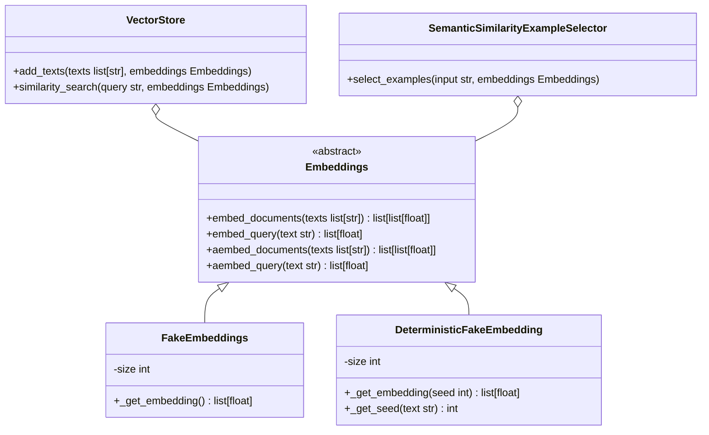
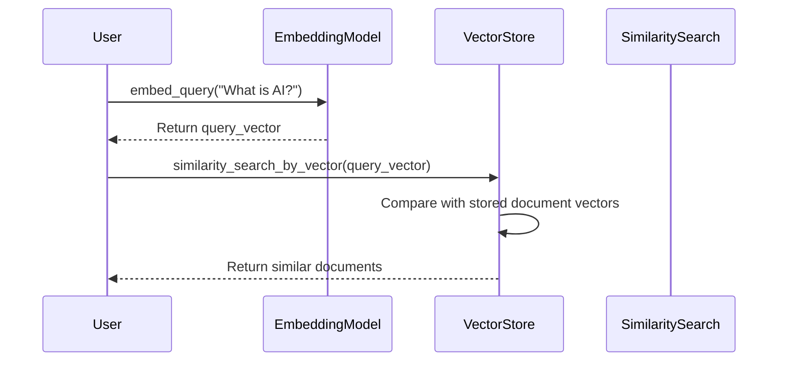
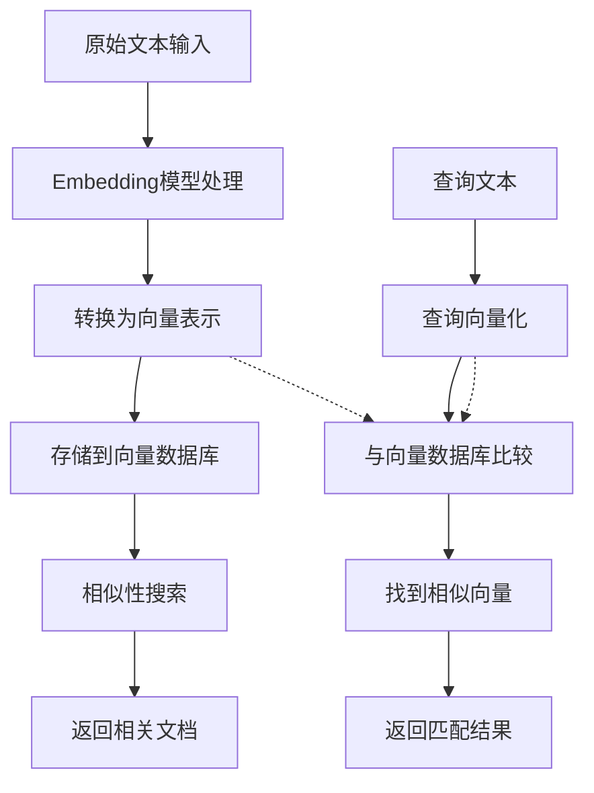

# LangChain Embeddings：深入浅出详解

## 目录
1. [技术模块概览](#技术模块概览)
2. [技术架构图](#技术架构图)
3. [技术原理详解](#技术原理详解)
4. [源码设计思想](#源码设计思想)
5. [核心实现分析](#核心实现分析)
6. [实际应用与最佳实践](#实际应用与最佳实践)

## 技术模块概览

### 1. 核心接口模块
- **Embeddings抽象基类** - 定义了嵌入模型的接口规范
- **embed_documents方法** - 批量嵌入文档
- **embed_query方法** - 单个查询嵌入
- **异步方法** - aembed_documents和aembed_query

### 2. 实现模块
- **FakeEmbeddings** - 用于测试的假嵌入模型
- **DeterministicFakeEmbedding** - 确定性假嵌入模型

### 3. 集成模块
- **第三方嵌入服务集成** - OpenAI, Google Vertex AI, Hugging Face等
- **向量数据库集成** - 与vectorstores的配合使用
- **示例选择器集成** - SemanticSimilarityExampleSelector等

### 4. 辅助模块
- **缓存机制** - 提高重复嵌入的效率
- **异步处理** - 支持异步嵌入操作

## 技术架构图

### 类结构图


### 调用时序图


### 工作流程图


### 实际使用示例
```python
# 基本使用示例
from langchain_core.embeddings import Embeddings
from langchain_core.embeddings import FakeEmbeddings
import numpy as np

# 创建假嵌入模型实例（用于测试）
embeddings = FakeEmbeddings(size=100)

# 嵌入单个查询
query_text = "What is machine learning?"
query_embedding = embeddings.embed_query(query_text)
print(f"Query embedding length: {len(query_embedding)}")

# 嵌入多个文档
documents = [
    "Machine learning is a subset of artificial intelligence.",
    "Deep learning uses neural networks with multiple layers.",
    "Natural language processing helps computers understand text."
]
doc_embeddings = embeddings.embed_documents(documents)
print(f"Number of document embeddings: {len(doc_embeddings)}")
print(f"Each document embedding length: {len(doc_embeddings[0])}")

# 异步使用示例
import asyncio

async def async_embedding_example():
    query_embedding = await embeddings.aembed_query("Async query")
    doc_embeddings = await embeddings.aembed_documents(["Doc 1", "Doc 2"])
    return query_embedding, doc_embeddings

# 运行异步示例
# result = asyncio.run(async_embedding_example())
```

## 技术原理详解

### What（是什么）

**嵌入（Embeddings）** 是一种将文本、图像等非结构化数据转换为数值向量（即一串数字）的技术。在LangChain中，Embeddings是将文本转换为高维向量表示的组件。这些向量捕捉了原始数据的语义信息，相似含义的文本在向量空间中距离较近。

可以将Embeddings想象成一个翻译器：它把人类能理解的文字翻译成AI能理解的数字语言。比如，"猫"和"小猫"这两个词虽然字面不同，但在向量空间中会非常接近，因为它们的语义相似。

### Why（为什么需要）

1. **语义理解**：计算机无法直接理解文本的含义，但可以处理数值计算。Embeddings让计算机能够理解文本的语义相似性。

2. **相似性搜索**：通过向量距离计算，可以快速找到与查询语义相似的文档，这是RAG（检索增强生成）系统的核心。

3. **降维表示**：将复杂的语义信息压缩到固定长度的向量中，便于存储和计算。

4. **统一表示**：不同语言、不同长度的文本都可以转换为相同格式的向量，便于统一处理。

### How（如何实现）

1. **文本预处理**：将输入文本进行分词、清理等预处理操作。

2. **向量化**：通过神经网络模型（如Transformer）将文本转换为向量。

3. **标准化**：对向量进行归一化处理，确保向量长度一致。

4. **存储索引**：将向量存储到向量数据库中，建立索引以支持快速检索。

在LangChain中，Embeddings通过统一的接口实现：

- `embed_documents(texts)`：将多个文档转换为向量列表
- `embed_query(text)`：将单个查询转换为向量
- 提供同步和异步两种调用方式

### 核心概念解析

1. **向量空间**：一个n维的数学空间，每个文本都被表示为这个空间中的一个点（向量）。

2. **语义距离**：在向量空间中，语义相似的文本对应的向量距离较近，语义差异大的文本向量距离较远。

3. **维度**：向量的长度，通常从几十到几千维不等。维度越高，能表达的语义信息越丰富。

4. **余弦相似度**：衡量两个向量相似性的常用方法，值越接近1表示越相似。

## 源码设计思想

### 设计思想分析

1. **接口抽象原则**：Embeddings类采用了抽象基类（ABC）设计模式，强制实现者必须实现`embed_documents`和`embed_query`两个核心方法。这种设计确保了所有嵌入模型都遵循统一的接口规范，提高了系统的可扩展性和可维护性。

2. **同步异步并存**：框架同时提供同步和异步方法，异步方法默认通过线程池执行同步方法，但允许实现者提供原生异步实现以获得更好的性能。这体现了"默认合理，可优化"的设计哲学。

3. **单一职责原则**：每个嵌入模型只负责将文本转换为向量，不承担其他职责。这种职责分离使得系统更加模块化和可测试。

4. **测试友好设计**：提供了FakeEmbeddings和DeterministicFakeEmbedding，专门用于单元测试。FakeEmbeddings生成随机向量，而DeterministicFakeEmbedding基于输入文本的哈希值生成确定性向量，便于测试验证。

## 核心实现分析

### 抽象基类实现
- `embed_documents(texts: list[str]) -> list[list[float]]`：将文本列表转换为向量列表
- `embed_query(text: str) -> list[float]`：将单个文本转换为向量
- 提供默认的异步实现，通过`run_in_executor`在后台线程中执行同步方法

### 假嵌入实现
- `FakeEmbeddings`：使用numpy随机生成指定维度的向量
- `DeterministicFakeEmbedding`：基于输入文本的SHA256哈希值作为随机种子，确保相同输入产生相同输出

### 集成设计
- 与VectorStore集成：向量数据库使用Embeddings来转换文本
- 与ExampleSelector集成：示例选择器使用嵌入来找到语义相似的示例

### 可扩展性
- 通过继承Embeddings基类，可以轻松添加新的嵌入模型
- 支持第三方嵌入服务（如OpenAI、Hugging Face、Google等）的集成

这种设计的核心优势在于提供了一个标准化的接口，让开发者可以无缝切换不同的嵌入模型，同时保持代码的一致性。框架的抽象设计使得上层应用无需关心底层嵌入模型的具体实现，只需通过统一的接口进行操作。

## 实际应用与最佳实践

### 什么是Embeddings？—— 语言模型的"翻译官"

想象一下，如果你是一个只懂数字不懂文字的外星人，而地球上的人们用各种语言向你提问。这时候就需要一个"翻译官"，把人类的语言（比如"苹果"、"orange"）翻译成你能够理解的数字密码。这个翻译官就是Embeddings。

在AI的世界里，语言模型本质上只能处理数字，无法直接理解文字的含义。Embeddings就像一个神奇的翻译器，它将文字转换成一串数字（向量），这串数字保留了原文的语义信息。这样，AI就能通过计算数字之间的距离来判断文字之间的相似性。

### 为什么需要Embeddings？—— 解决语义理解的难题

传统的文本匹配方式（如关键词匹配）存在明显局限性。比如搜索"汽车"时，无法找到包含"轿车"的内容，尽管它们含义相近。Embeddings解决了这个难题：

1. **语义理解**：能够识别"快乐"和"开心"的相似性
2. **模糊匹配**：实现概念层面的搜索，而非仅仅字面匹配
3. **向量化存储**：将复杂的语义信息转换为便于计算和存储的数值形式

### LangChain Embeddings的核心设计—— 简洁而强大的架构

LangChain的Embeddings设计遵循了"约定优于配置"的原则，提供了简洁而强大的接口：

```python
# 两种核心操作
embeddings.embed_documents(texts) # 批量处理文档
embeddings.embed_query(text)       # 处理单个查询
```

这种设计的巧妙之处在于：
- **统一接口**：无论使用OpenAI、Hugging Face还是自定义模型，调用方式都相同
- **灵活性**：支持同步和异步操作，适应不同场景需求
- **可扩展性**：通过继承基类，可以轻松集成新的嵌入模型

### 实际应用场景—— 让AI更懂你

Embeddings在RAG（检索增强生成）系统中发挥着核心作用：

1. **文档预处理**：将知识库中的文档转换为向量并存储
2. **查询理解**：将用户问题转换为向量
3. **相似性检索**：在向量空间中找到与问题最相关的文档
4. **内容生成**：基于检索到的相关信息生成回答

这种机制让AI能够基于特定知识库回答问题，避免了传统模型的"幻觉"问题。

### 设计哲学—— 抽象之美

LangChain Embeddings的设计体现了几个重要哲学：

1. **接口抽象**：通过抽象基类强制实现统一接口，确保不同嵌入模型的互换性
2. **测试友好**：提供FakeEmbeddings便于单元测试，体现了对代码质量的重视
3. **性能考虑**：同时提供同步和异步方法，适应不同性能需求
4. **渐进式复杂性**：简单场景下开箱即用，复杂场景下提供深度定制能力

### 总结—— 连接人类语言与机器计算的桥梁

Embeddings是连接人类自然语言与机器计算的桥梁，它让AI能够理解语义而非仅仅识别字符。LangChain通过精心设计的抽象接口，让开发者能够轻松利用各种嵌入模型，构建出更加智能的应用程序。

理解Embeddings不仅有助于掌握LangChain的使用，更重要的是理解了现代AI系统中语义理解的基础机制。这是构建智能应用不可或缺的核心技术。