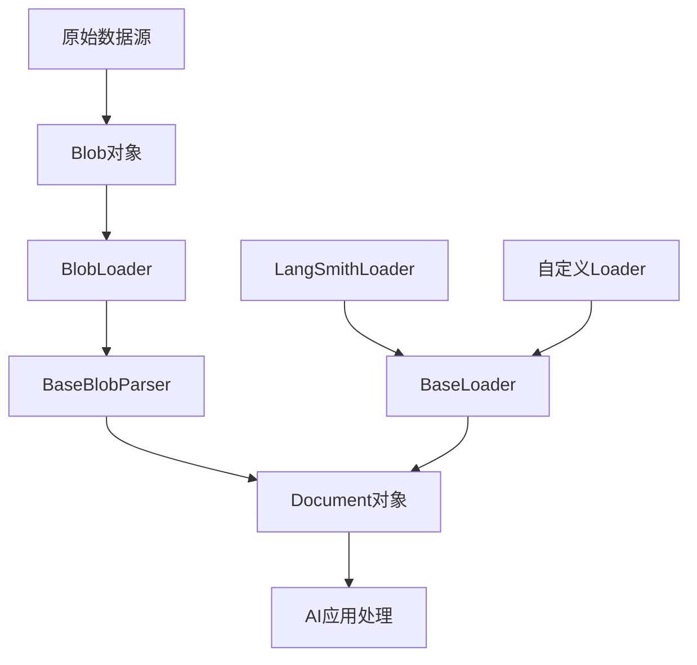

# LangChain文档加载器 (Document Loaders) 深度解析

## What - 什么是文档加载器？

文档加载器（Document Loaders）是LangChain框架中用于从各种数据源加载文档内容的核心组件。它们就像是AI应用的"消化系统"，负责将原始的、各种格式的数据"消化"成AI模型能够理解和处理的格式。

具体来说，文档加载器的主要功能是：
- 从不同的数据源（如PDF、Word文档、网页、数据库等）读取数据
- 将读取的数据转换为LangChain的Document对象
- 为每个文档添加元数据（如来源、创建时间等）
- 支持懒加载（Lazy Loading），避免一次性加载大量数据导致内存溢出

## Why - 为什么需要文档加载器？

想象一下，如果你是一位图书管理员，需要处理来自不同渠道的书籍（纸质书、电子书、音频书等），并且要让这些书籍能够被读者快速检索和使用。你肯定需要一套标准化的处理流程，将这些不同格式的书籍转换为统一的管理格式。

同样，在AI应用开发中，我们面临以下挑战：

### 1. 数据源多样化
现实世界中的数据格式千差万别：
- 结构化数据：数据库、CSV文件
- 半结构化数据：JSON、XML文件
- 非结构化数据：PDF文档、Word文档、网页、电子邮件等

### 2. 数据处理标准化
AI模型需要统一格式的输入，文档加载器提供了一个标准化的接口，将各种格式的数据转换为LangChain的Document对象。

### 3. 内存和性能优化
对于大型文档集合，一次性加载所有数据会消耗大量内存。文档加载器支持懒加载，可以按需加载数据，优化内存使用。

### 4. 元数据管理
在处理文档时，保留来源信息、创建时间等元数据对于后续的检索和处理非常重要。

## How - 文档加载器如何工作？

### 核心架构



### 核心组件详解

#### 1. Document类
Document是LangChain中表示文档的基本数据结构，包含：
- `page_content`: 文档的实际内容（字符串）
- `metadata`: 文档的元数据（字典）
- `id`: 文档的唯一标识符（可选）

#### 2. Blob类
Blob（Binary Large Object）表示原始数据，可以是：
- 从内存中的字符串或字节数据创建
- 从文件路径引用创建
- 包含MIME类型、编码等信息

#### 3. BaseLoader基类
所有文档加载器的抽象基类，定义了标准接口：
- `load()`: 同步加载所有文档
- `lazy_load()`: 懒加载，逐个产生文档
- `aload()`: 异步加载
- `load_and_split()`: 加载并分割文档

#### 4. BlobLoader抽象类
专门用于加载原始数据的抽象类，定义了`yield_blobs()`方法。

#### 5. BaseBlobParser抽象类
用于解析Blob对象为Document对象，包含`lazy_parse()`和`parse()`方法。

### 使用示例

#### 基础使用
```python
from langchain_core.document_loaders import BaseLoader
from langchain_core.documents import Document

class MyCustomLoader(BaseLoader):
    def __init__(self, file_path: str):
        self.file_path = file_path

    def lazy_load(self):
        with open(self.file_path, encoding="utf-8") as f:
            content = f.read()
            yield Document(
                page_content=content,
                metadata={"source": self.file_path}
            )

# 使用加载器
loader = MyCustomLoader("example.txt")
documents = loader.load()
```

### 核心实现原理

#### 1. 懒加载机制
文档加载器采用生成器模式实现懒加载，只在需要时才加载数据，有效控制内存使用。

#### 2. 解析器与加载器的分离
架构设计中将数据加载和数据解析分离，提高了组件的可重用性。

#### 3. 统一的错误处理
所有加载器都遵循相同的错误处理模式，确保API的一致性。

### 实际应用场景

#### 1. 多格式文档处理
处理PDF、Word、CSV、网页等多种格式的文档。

#### 2. 数据管道构建
构建从数据加载到预处理的完整数据管道。

### 设计思想和核心实现

#### 1. 抽象与实现分离
通过抽象基类定义标准接口，具体实现可以灵活扩展。

#### 2. 单一职责原则
每个组件都有明确的职责，便于维护和扩展。

#### 3. 开闭原则
系统对扩展开放，对修改封闭。

#### 4. 惰性求值
通过`lazy_load`方法实现惰性求值，优化内存使用。

## 总结

LangChain的文档加载器是一个精心设计的组件系统，它通过抽象接口、懒加载机制和组件分离等设计模式，解决了AI应用中数据源多样化、格式标准化、性能优化等关键问题。其设计思想体现了现代软件架构的最佳实践，为构建可扩展的AI应用提供了坚实的基础。