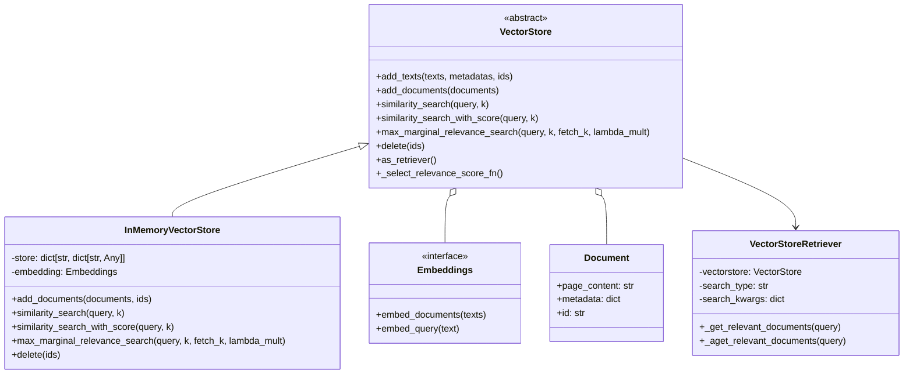
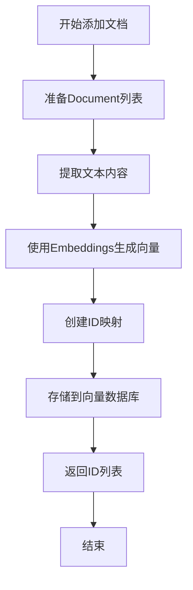
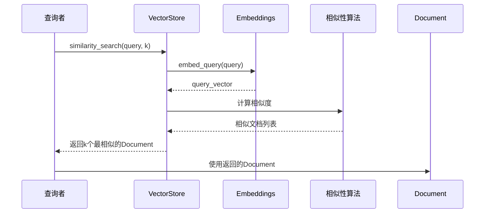

# LangChain向量存储（Vectorstores）全面指南

## 什么是向量存储？

向量存储（Vectorstores）是现代AI应用的核心组件，专门用于存储和检索高维向量数据。简单来说，它就像一个智能图书馆，能够快速找到与你查询内容"意思相近"的信息，而不仅仅是"字面相同"的信息。

想象一下，你正在教一个不懂中文的外国朋友什么是"汽车"。传统搜索就像给他一本字典，让他查找"汽车"这两个字；而向量存储则像给他看了一千张汽车图片后，他能立刻认出"车辆"、"轿车"、"机动车"等相似概念。

在LangChain中，向量存储主要负责：
- 存储文档的向量表示（通过嵌入模型生成）
- 执行高效相似性搜索
- 提供检索接口给下游应用

## 为什么需要向量存储？

### 1. 语义理解的突破
传统关键词搜索存在严重局限性。比如，搜索"人工智能"时，包含"机器学习"、"深度学习"、"AI"的文档可能同样相关，但传统搜索无法找到它们。向量存储通过向量化表示，能够理解语义相似性，解决了这一痛点。

### 2. RAG系统的基石
检索增强生成（RAG）系统依赖向量存储来从海量知识库中检索相关信息，然后结合LLM生成更准确、更相关的回答。没有高效的向量存储，RAG系统就失去了"记忆"能力。

### 3. 高效处理非结构化数据
文本、图像等非结构化数据无法直接存储在传统数据库中进行相似性搜索。向量存储将这些数据转换为向量后，可以高效地进行相似性计算和检索。

## 核心技术模块

### 1. VectorStore 抽象基类
定义了向量存储的标准接口，包括：
- `add_texts()`: 添加文本到向量存储
- `similarity_search()`: 相似性搜索
- `max_marginal_relevance_search()`: MMR搜索
- `delete()`: 删除文档

### 2. VectorStoreRetriever
继承自BaseRetriever，提供检索功能，支持：
- 相似性搜索
- MMR搜索
- 分数阈值搜索

### 3. InMemoryVectorStore
内存向量存储的具体实现，使用字典存储向量和文档的映射关系。

### 4. 向量搜索算法
- 相似性搜索（similarity search）
- 最大边际相关性搜索（MMR）
- 基于分数阈值的搜索

### 5. 工具函数
- 余弦相似度计算
- 最大边际相关性算法

## 技术架构

### 类图


### 工作流程


### 搜索时序


## 核心实现原理

### 存储结构
```python
# InMemoryVectorStore使用字典存储结构
self.store: dict[str, dict[str, Any]] = {}
# 每个条目包含：id、vector、text、metadata
```

### 相似性搜索
使用余弦相似度计算向量间的相似度，返回最相似的k个文档。

### MMR算法
最大边际相关性算法平衡了相关性和多样性，通过lambda_mult参数控制平衡权重。

## 设计思想

1. **抽象与实现分离**：使用抽象基类定义统一接口
2. **组合优于继承**：VectorStoreRetriever通过组合VectorStore
3. **统一的API设计**：提供同步和异步两套API
4. **关注点分离**：存储、嵌入、检索职责分明

## 实际应用示例

```python
from langchain_core.vectorstores import InMemoryVectorStore
from langchain_core.documents import Document
from langchain_openai import OpenAIEmbeddings

# 1. 初始化嵌入模型
embeddings = OpenAIEmbeddings()

# 2. 创建向量存储
vector_store = InMemoryVectorStore(embedding=embeddings)

# 3. 准备文档
document_1 = Document(id="1", page_content="人工智能是计算机科学的一个分支", metadata={"category": "AI"})
document_2 = Document(id="2", page_content="机器学习是人工智能的子领域", metadata={"category": "ML"})
document_3 = Document(id="3", page_content="深度学习使用神经网络进行学习", metadata={"category": "DeepLearning"})

documents = [document_1, document_2, document_3]

# 4. 添加文档到向量存储
ids = vector_store.add_documents(documents=documents)
print(f"添加文档的ID: {ids}")

# 5. 执行相似性搜索
results = vector_store.similarity_search(query="神经网络", k=2)
for doc in results:
    print(f"内容: {doc.page_content}, 元数据: {doc.metadata}")

# 6. 使用检索器
retriever = vector_store.as_retriever(search_type="similarity", search_kwargs={"k": 1})
retrieved_docs = retriever.invoke("人工智能")
print(f"检索到的文档: {retrieved_docs}")

# 7. 执行MMR搜索（最大边际相关性）
mmr_results = vector_store.max_marginal_relevance_search(query="AI技术", k=2, fetch_k=5)
print(f"MMR搜索结果: {mmr_results}")
```

## 总结

向量存储是现代AI应用的重要基础设施，通过将非结构化数据转换为向量表示，实现了语义级别的搜索和检索。LangChain的向量存储模块通过抽象设计和统一接口，为开发者提供了灵活、高效的向量存储解决方案，是构建RAG系统和其他AI应用不可或缺的组件。