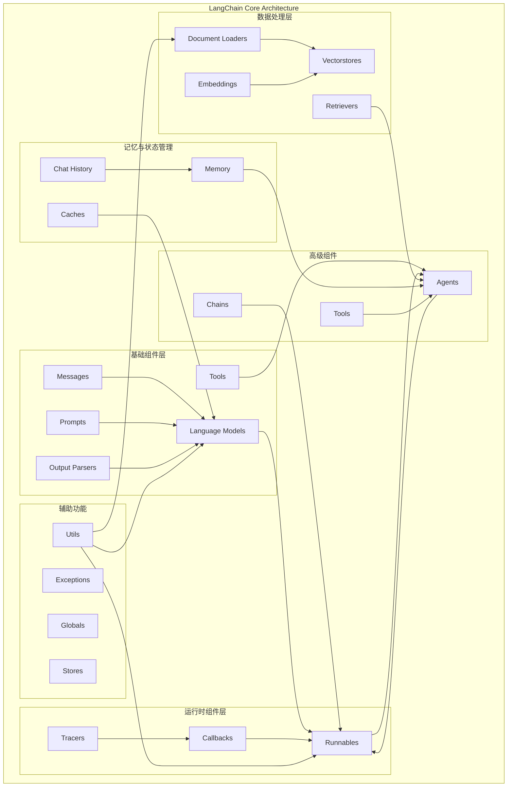
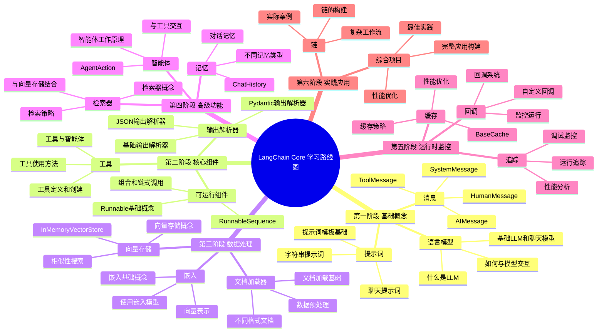

# LangChain Core 学习路线图

## 项目技术架构图

## 由浅入深的教学模块

### 第一阶段：基础概念 (Foundation)
1. **语言模型 (Language Models)**
   - 基础概念：什么是LLM，如何与模型交互
   - 实践：使用基础的LLM和聊天模型
   - 核心文件：[language_models/base.py](language_models/base.py:97:415), [language_models/llms.py](language_models/llms.py:292:1440), [language_models/chat_models.py](language_models/chat_models.py:219:1558)

2. **消息 (Messages)**
   - 消息类型：HumanMessage, AIMessage, SystemMessage, ToolMessage
   - 消息格式和结构
   - 核心文件：[messages/](messages/) 目录下的所有文件

3. **提示词 (Prompts)**
   - 提示词模板基础
   - 字符串提示词 vs 聊天提示词
   - 核心文件：[prompts/](prompts/) 目录下的主要文件

### 第二阶段：核心组件 (Core Components)
4. **输出解析器 (Output Parsers)**
   - 基础输出解析器
   - JSON输出解析器
   - Pydantic输出解析器
   - 核心文件：[output_parsers/](output_parsers/) 目录

5. **工具 (Tools)**
   - 工具定义和创建
   - 工具使用方法
   - 核心文件：[tools/](tools/) 目录

6. **可运行组件 (Runnables)**
   - Runnable基础概念
   - 可运行组件的组合和链式调用
   - 核心文件：[runnables/base.py](runnables/base.py:108:2488), [runnables/passthrough.py](runnables/passthrough.py:7:357)

### 第三阶段：数据处理 (Data Processing)
7. **嵌入 (Embeddings)**
   - 嵌入基础概念
   - 如何使用嵌入模型
   - 核心文件：[embeddings/](embeddings/) 目录

8. **文档加载器 (Document Loaders)**
   - 文档加载基础
   - 不同格式文档加载
   - 核心文件：[document_loaders/](document_loaders/) 目录

9. **向量存储 (Vectorstores)**
   - 向量存储概念
   - 相似性搜索
   - 核心文件：[vectorstores/](vectorstores/) 目录

### 第四阶段：高级功能 (Advanced Features)
10. **检索器 (Retrievers)**
    - 检索器概念和实现
    - 与向量存储结合使用
    - 核心文件：[retrievers.py](retrievers.py:68:458)

11. **记忆 (Memory)**
    - 对话记忆
    - 不同类型的记忆机制
    - 核心文件：[memory.py](memory.py:28:116), [chat_history.py](chat_history.py:35:206)

12. **智能体 (Agents)**
    - 智能体工作原理
    - 智能体与工具的交互
    - 核心文件：[agents.py](agents.py:40:94)

### 第五阶段：运行时与监控 (Runtime & Monitoring)
13. **回调 (Callbacks)**
    - 回调系统
    - 如何使用回调监控运行
    - 核心文件：[callbacks/](callbacks/) 目录

14. **追踪 (Tracers)**
    - 运行追踪
    - 调试和性能监控
    - 核心文件：[tracers/](tracers/) 目录

15. **缓存 (Caches)**
    - 缓存策略
    - 性能优化
    - 核心文件：[caches.py](caches.py:38:146)

### 第六阶段：实践应用 (Practical Applications)
16. **链 (Chains)**
    - 链的构建和使用
    - 复杂工作流设计
    - 实际案例练习

17. **综合项目**
    - 构建完整的LangChain应用
    - 最佳实践
    - 性能优化

## 学习思维导图

这个学习路线图提供了从基础到高级的完整学习路径，每个阶段都有明确的学习目标和核心文件参考，适合不同水平的学习者循序渐进地掌握LangChain Core。